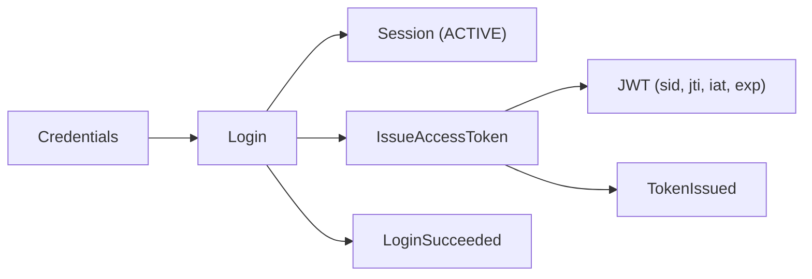

# Login

> ← Back to [Module Index](../SPEC.md#capabilities) · Stories: [US-01](../STORIES.md#us-01-user-logs-in-with-valid-credentials), [US-02](../STORIES.md#us-02-login-rejected-for-invalid-credentials-or-disabled-principal)

Start an authenticated session and receive an access token.

## Aspect Map

| Aspect | Concept | Summary |
| ------ | ------- | ------- |
| Operation | [Login](../operations.md#login) | Validates credentials + risk policy, creates ACTIVE session |
| Operation | [IssueAccessToken](../operations.md#issueaccesstoken) | Mints JWT with `sid`, `jti`, `iat`, `exp` claims |
| Interface | [POST /auth/login](../interfaces.md#post-authlogin) | Public endpoint, returns `{ accessToken, expiresAt, sessionId }` |
| Mapping | [LoginRequestToSession](../mappings.md#loginrequesttosession) | HTTP request → Session with 8h TTL |
| State | [SessionLifecycle](../states.md#sessionlifecycle) | `[new] → ACTIVE` on LoginSucceeded |
| State | [TokenLifecycle](../states.md#tokenlifecycle) | `[new] → ACTIVE` on TokenIssued |
| Events | [LoginSucceeded](../events.md#loginsucceeded), [TokenIssued](../events.md#tokenissued) | Audit trail for login and token issuance |

## Flow

## Rules

| ID | Rule | Formal |
| -- | ---- | ------ |
| R1 | Principal must exist and be active | `principal(identifier).status = ACTIVE` |
| R2 | Credential verification must succeed | `verifyCredential(identifier, secret) = true` |
| R3 | Login policy checks must pass | `riskPolicy(context) = ALLOW` |

Risk policy denies when: IP blocked, ≥5 failed attempts in 15m, or missing user-agent.

## Calculations

| ID | Calculation | Formula |
| -- | ----------- | ------- |
| C1 | Session expiration | `session.expiresAt = now + 8h` |
| C2 | Effective permissions | `resolvePermissions(roleKeys, directPermissions, grants)` |

## Error States

| Condition | Result |
| --------- | ------ |
| R1 violated | `PRINCIPAL_DISABLED` |
| R2 violated | `INVALID_CREDENTIALS` |
| R3 violated | `FORBIDDEN` |
| Persistence failure | Internal error |

## Domain Concepts Used

- [Principal](../domain.md#principal) — authenticated subject
- [Session](../domain.md#session) — created with 8h TTL
- [AccessToken](../domain.md#accesstoken) — issued JWT
