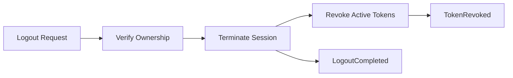

# Logout

> ← Back to [Module Index](../SPEC.md#capabilities) · Stories: [US-06](../STORIES.md#us-06-user-terminates-own-session), [US-07](../STORIES.md#us-07-admin-force-terminates-another-users-session)

Terminate a session and revoke active tokens.

## Aspect Map

| Aspect | Concept | Summary |
| ------ | ------- | ------- |
| Operation | [Logout](../operations.md#logout) | Terminates session, revokes linked tokens |
| Interface | [POST /auth/logout](../interfaces.md#post-authlogout) | JWT + active session required |
| Mapping | [LogoutRequestToTermination](../mappings.md#logoutrequesttotermination) | HTTP request → Logout input with defaults |
| State | [SessionLifecycle](../states.md#sessionlifecycle) | `ACTIVE → TERMINATED` on LogoutCompleted |
| State | [TokenLifecycle](../states.md#tokenlifecycle) | `ACTIVE → REVOKED` on TokenRevoked |
| Events | [TokenRevoked](../events.md#tokenrevoked), [LogoutCompleted](../events.md#logoutcompleted) | Revocation and session termination audit |

## Flow

## Rules

| ID | Rule | Formal |
| -- | ---- | ------ |
| R1 | Session must exist and be active | `session(sessionId).status = ACTIVE` |
| R2 | Caller must own session or hold admin permission | `caller.principalId = session.principalId or hasPermission(caller, 'auth-access-control.admin.logoutAnySession')` |
| R3 | Revocation evidence must be persisted | `persistRevocation(sessionId, revokedTokens) = success` |

## State Transitions

| Entity | From | To | Trigger |
| ------ | ---- | -- | ------- |
| Session | ACTIVE | TERMINATED | LogoutCompleted |
| AccessToken | ACTIVE | REVOKED | TokenRevoked |

Both TERMINATED and REVOKED are terminal states — no further transitions are possible.

## Error States

| Condition | Result |
| --------- | ------ |
| R1 violated | `AUTH_REQUIRED` |
| R2 violated | `FORBIDDEN` |
| R3 violated | Internal error |

## Domain Concepts Used

- [Session](../domain.md#session) — terminated on logout
- [AccessToken](../domain.md#accesstoken) — revoked tokens
- [SessionLifecycle](../states.md#sessionlifecycle) — ACTIVE → TERMINATED
- [TokenLifecycle](../states.md#tokenlifecycle) — ACTIVE → REVOKED
