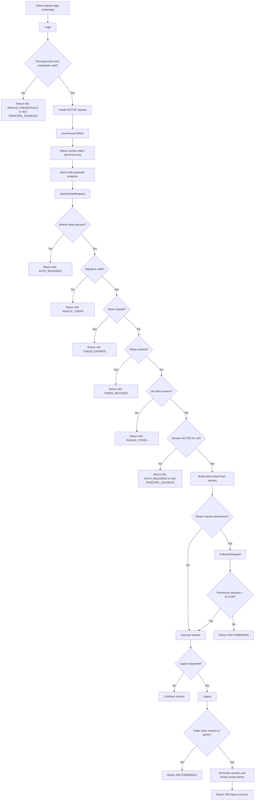
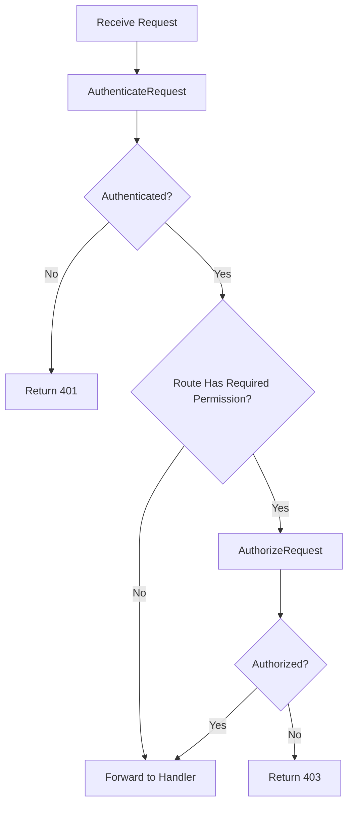

# Workflows: Authentication and Access Control

> **Capabilities using this aspect:** [Authenticate Request](capabilities/authenticate-request.md) · [Authorize Request](capabilities/authorize-request.md)

## EndToEndAuthFlow

**Type:** Workflow
**Triggers:** Login, protected API call, logout request
**Orchestrates:** [Login](operations.md#login), [IssueAccessToken](operations.md#issueaccesstoken), [AuthenticateRequest](operations.md#authenticaterequest), [AuthorizeRequest](operations.md#authorizerequest), [Logout](operations.md#logout)
**Compensation Strategy:** notify-only
**Idempotency:** conditional: protected calls are idempotent at auth layer, login/logout are not strictly idempotent

### Full Flow Diagram



## AuthorizeRequestFlow

**Type:** Workflow
**Triggers:** Incoming request to protected endpoint
**Orchestrates:** [AuthenticateRequest](operations.md#authenticaterequest), [AuthorizeRequest](operations.md#authorizerequest)
**Compensation Strategy:** notify-only
**Idempotency:** yes

### Steps



### Step Table

| #   | Step                            | Actor           | Operation                                                | On Success                     | On Failure           | Compensation     |
| --- | ------------------------------- | --------------- | -------------------------------------------------------- | ------------------------------ | -------------------- | ---------------- |
| 1   | Parse and verify credential     | Auth middleware | [AuthenticateRequest](operations.md#authenticaterequest) | Go to step 2                   | Return 401           | —                |
| 2   | Resolve route permission policy | Auth middleware | [AuthorizeRequest](operations.md#authorizerequest)       | Go to step 3                   | Return 403           | —                |
| 3   | Execute protected handler       | Feature handler | N/A                                                      | Return 2xx/4xx domain response | Return handler error | Emit audit event |

### Invariants

| ID  | Invariant                                         | Formal                                                                  |
| --- | ------------------------------------------------- | ----------------------------------------------------------------------- |
| I1  | Protected routes always authenticate first        | `route.protected = true => AuthenticateRequest executed before handler` |
| I2  | Authorization never executes without auth context | `AuthorizeRequest.input.authContext != null`                            |

---

## PermissionResolutionPolicy

**Type:** Policy
**Applies To:** [AuthorizeRequest](operations.md#authorizerequest)
**Trigger Conditions:** Evaluated for protected routes with required permission configured

### Decision Table

| Condition                                             | Selected Behavior | Notes                     |
| ----------------------------------------------------- | ----------------- | ------------------------- |
| Exact allow match exists and no deny match exists     | Allow             | Highest precedence allow  |
| Deny match exists                                     | Deny              | Deny overrides allow      |
| Scoped wildcard allow exists and no deny match exists | Allow             | Example: `service.read.*` |
| Global wildcard allow exists and no deny match exists | Allow             | Example: `*.*.*`          |
| No matches                                            | Deny              | Default deny              |

### Formula (if applicable)

```
precedence = deny > allow.exact > allow.scopedWildcard > allow.globalWildcard > noMatch
```

### Configuration Parameters

| Parameter           | Type    | Default | Description                      |
| ------------------- | ------- | ------- | -------------------------------- |
| wildcardEnabled     | boolean | true    | Enables wildcard matching        |
| denyOverrideEnabled | boolean | true    | Deny permissions override allows |
