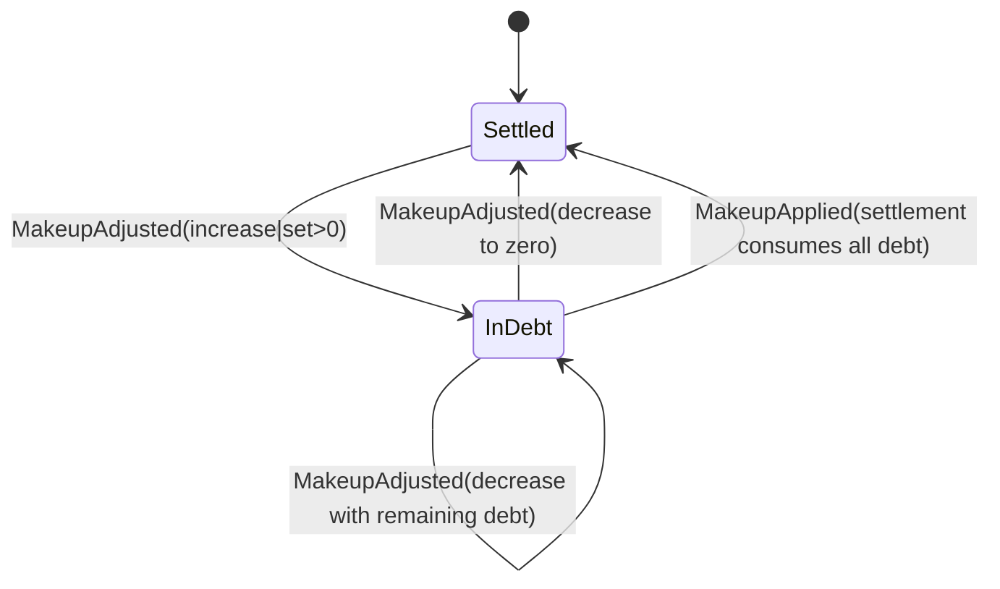

# State Machines: Player Makeup

## MakeupDebtState

### Transition Table

| From    | Event          | To      | Guard                           | Effect         |
| ------- | -------------- | ------- | ------------------------------- | -------------- |
| Settled | MakeupAdjusted | InDebt  | operation creates amount > 0    | debt increases |
| InDebt  | MakeupAdjusted | InDebt  | result > 0                      | debt updated   |
| InDebt  | MakeupAdjusted | Settled | result == 0                     | debt cleared   |
| InDebt  | MakeupApplied  | Settled | applied amount >= previous debt | debt cleared   |

### Invalid Transition Table

| From    | Event          | Guard Not Satisfied                | Expected Result                  |
| ------- | -------------- | ---------------------------------- | -------------------------------- |
| Settled | MakeupApplied  | n/a                                | reject transition, remain Settled |
| Settled | MakeupAdjusted | result == 0                        | reject transition, remain Settled |
| InDebt  | MakeupApplied  | applied amount < previous debt     | reject transition, remain InDebt  |

### Invariants

| ID  | Invariant                              | Formal                                     |
| --- | -------------------------------------- | ------------------------------------------ |
| I1  | Debt is never negative                 | `makeup >= 0`                              |
| I2  | No adjustment event when delta is zero | `delta == 0 => !create(MAKEUP_ADJUSTMENT)` |
