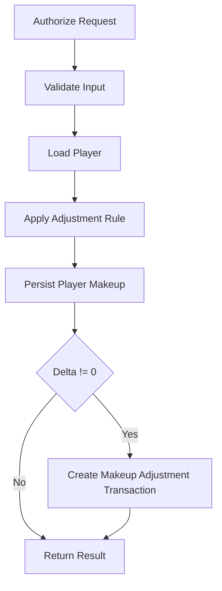

# Workflows: Player Makeup

## MakeupAdjustmentWorkflow

**Type:** Workflow  
**Triggers:** Manual API adjustment request  
**Orchestrates:** [AdjustPlayerMakeup](operations.md#adjustplayermakeup)  
**Compensation Strategy:** none  
**Idempotency:** no (multiple equal adjustments are allowed and intentional)

### Steps

### Step Table

| #   | Step                | Actor    | Operation          | On Success | On Failure | Compensation |
| --- | ------------------- | -------- | ------------------ | ---------- | ---------- | ------------ |
| 1   | Authorization check | API      | AdjustPlayerMakeup | Step 2     | 403        | -            |
| 2   | Validation          | API      | AdjustPlayerMakeup | Step 3     | 400        | -            |
| 3   | Domain execution    | Use-case | AdjustPlayerMakeup | Step 4     | 404/500    | -            |
| 4   | Audit persistence   | Use-case | AdjustPlayerMakeup | done       | 500        | none         |

### Invariants

| ID  | Invariant                           | Formal                         |
| --- | ----------------------------------- | ------------------------------ |
| I1  | Makeup never negative               | `currentMakeup >= 0`           |
| I2  | Audit entry only when value changes | `delta == 0 => no transaction` |

## SettlementMakeupApplicationContract

**Type:** Workflow contract
**Triggers:** Settlement execution in `financial-settlement`
**Producer:** `financial-settlement.GenerateSettlement`
**Consumer:** Player makeup state and makeup history
**Idempotency:** yes (per player and settlement period end date)

### Policy Application Rules

| ID  | Rule                                  | Formal                                           |
| --- | ------------------------------------- | ------------------------------------------------ |
| S1  | Existing makeup must be covered first | `makeup_before_payout >= 0`                      |
| S2  | Profit offsets makeup first           | `applied_from_profit = min(profit, makeup)`      |
| S3  | Rakeback offsets remaining makeup     | `applied_from_rakeback = min(rakeback, makeup')` |
| S4  | Remaining rakeback share to player    | `player_rakeback = rakeback_left * 0.5`          |

### Event Constraint

- Repeated settlement calls for same `(playerId, periodEndDate)` must not create duplicate `MAKEUP_APPLIED` or `PAYOUT` events.
