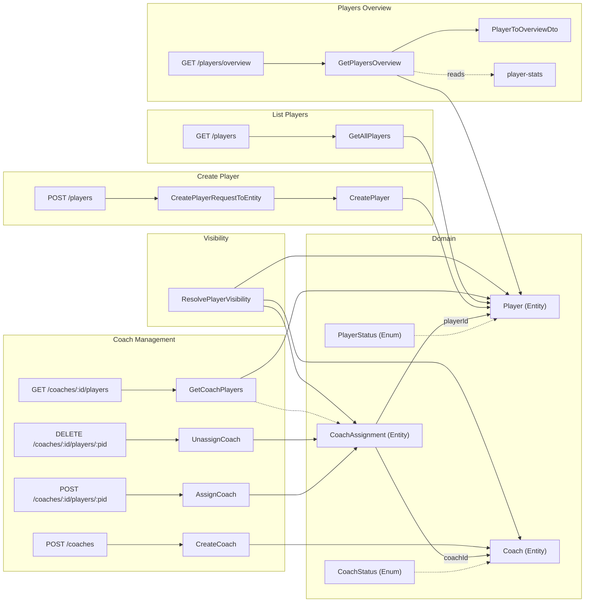

# Player Management

## What This Module Owns

Player Management is the source of truth for player identity, operational status, financial baseline, portfolio projections, and coach-to-player assignment. It exposes write operations for player and coach lifecycle, a cross-cutting visibility resolver consumed by makeup/stats/progression features, and read models for dashboard and operations.

## Module Map

## Capabilities

| Capability                                                             | What                                         | Key Aspects                                                | Detail                                                   |
| ---------------------------------------------------------------------- | -------------------------------------------- | ---------------------------------------------------------- | -------------------------------------------------------- |
| [Create Player](capabilities/create-player.md)                         | Register player + flat list                  | CreatePlayer + GetAllPlayers, POST /players, GET /players  | 1 operation, 1 query, 2 interfaces, 1 mapping, 6 rules   |
| [Players Overview](capabilities/players-overview.md)                   | Portfolio projections + progression check    | GetPlayersOverview + PlayerToOverviewDto, CheckProgression | 2 queries, 2 interfaces, 1 mapping, cross-module stats   |
| [Coach Lifecycle](capabilities/coach-lifecycle.md)                     | Register coach + list coaches                | CreateCoach + GetAllCoaches, POST /coaches, GET /coaches   | 1 operation, 1 query, 2 interfaces, 1 mapping, 4 rules   |
| [Coach Assignment](capabilities/coach-assignment.md)                   | Assign/unassign coach, list assigned players | AssignCoach + UnassignCoach + GetCoachPlayers              | 2 operations, 1 query, 3 interfaces, 2 mappings, 7 rules |
| [Resolve Player Visibility](capabilities/resolve-player-visibility.md) | Cross-cutting player access resolver         | ResolvePlayerVisibility → makeup, stats consumers          | 1 query, 3-level priority (admin/coach/player)           |

## Capability Anchors

### Create Player

Canonical capability anchor for cross-aspect references.

### List All Players

Canonical capability anchor for cross-aspect references.

### Players Overview

Canonical capability anchor for cross-aspect references.

### Check Player Progression

Canonical capability anchor for cross-aspect references.

### Create Coach

Canonical capability anchor for cross-aspect references.

### Assign Coach

Canonical capability anchor for cross-aspect references.

### Unassign Coach

Canonical capability anchor for cross-aspect references.

### List Coach Players

Canonical capability anchor for cross-aspect references.

### List All Coaches

Canonical capability anchor for cross-aspect references.

### Resolve Player Visibility

Canonical capability anchor for cross-aspect references.

## Domain Concepts

| Concept                                      | Type   | Key Constraints                                                                                  |
| -------------------------------------------- | ------ | ------------------------------------------------------------------------------------------------ |
| [Player](domain.md#player)                   | Entity | `email` unique via canonical key; `bankroll >= 0`; `makeup >= 0`; `currentLimit` in {NL20–NL100} |
| [PlayerStatus](domain.md#playerstatus)       | Enum   | ACTIVE · INACTIVE · OBSERVATION                                                                  |
| [Coach](domain.md#coach)                     | Entity | `principalId` unique among active coaches                                                        |
| [CoachStatus](domain.md#coachstatus)         | Enum   | ACTIVE · INACTIVE                                                                                |
| [CoachAssignment](domain.md#coachassignment) | Entity | One active coach per player (`UNIQUE(playerId) WHERE unassignedAt IS NULL`); soft-delete         |

## Concept Registry

<!-- Source of truth for global registry sync -->

| Concept                                                                | ID                                            | Type        |
| ---------------------------------------------------------------------- | --------------------------------------------- | ----------- |
| [Player](domain.md#player)                                             | player-management.Player                      | Entity      |
| [PlayerStatus](domain.md#playerstatus)                                 | player-management.PlayerStatus                | Enum / Type |
| [Coach](domain.md#coach)                                               | player-management.Coach                       | Entity      |
| [CoachStatus](domain.md#coachstatus)                                   | player-management.CoachStatus                 | Enum / Type |
| [CoachAssignment](domain.md#coachassignment)                           | player-management.CoachAssignment             | Entity      |
| [CreatePlayer](operations.md#createplayer)                             | player-management.CreatePlayer                | Operation   |
| [CreateCoach](operations.md#createcoach)                               | player-management.CreateCoach                 | Operation   |
| [AssignCoach](operations.md#assigncoach)                               | player-management.AssignCoach                 | Operation   |
| [UnassignCoach](operations.md#unassigncoach)                           | player-management.UnassignCoach               | Operation   |
| [GetAllPlayers](queries.md#getallplayers)                              | player-management.GetAllPlayers               | Query       |
| [GetPlayersOverview](queries.md#getplayersoverview)                    | player-management.GetPlayersOverview          | Query       |
| [GetAllCoaches](queries.md#getallcoaches)                              | player-management.GetAllCoaches               | Query       |
| [GetCoachPlayers](queries.md#getcoachplayers)                          | player-management.GetCoachPlayers             | Query       |
| [ResolvePlayerVisibility](queries.md#resolveplayervisibility)          | player-management.ResolvePlayerVisibility     | Query       |
| [PlayerLifecycle](states.md#playerlifecycle)                           | player-management.PlayerLifecycle             | State Machine |
| [CoachLifecycle](states.md#coachlifecycle)                             | player-management.CoachLifecycle              | State Machine |
| [CoachAssignmentLifecycle](states.md#coachassignmentlifecycle)         | player-management.CoachAssignmentLifecycle    | State Machine |
| [PlayerCreated](events.md#playercreated)                               | player-management.PlayerCreated               | Event       |
| [CoachCreated](events.md#coachcreated)                                 | player-management.CoachCreated                | Event       |
| [CoachAssigned](events.md#coachassigned)                               | player-management.CoachAssigned               | Event       |
| [CoachUnassigned](events.md#coachunassigned)                           | player-management.CoachUnassigned             | Event       |
| [PlayerAPI](interfaces.md#external-playerapi-rest)                     | player-management.PlayerAPI                   | Interface   |
| [CoachAPI](interfaces.md#external-coachapi-rest)                       | player-management.CoachAPI                    | Interface   |
| [CreatePlayerRequestToEntity](mappings.md#createplayerrequesttoentity) | player-management.CreatePlayerRequestToEntity | Mapping     |
| [PlayerToOverviewDto](mappings.md#playertooverviewdto)                 | player-management.PlayerToOverviewDto         | Mapping     |
| [CreateCoachRequestToEntity](mappings.md#createcoachrequesttoentity)   | player-management.CreateCoachRequestToEntity  | Mapping     |
| [AssignCoachRequestToInput](mappings.md#assigncoachrequesttoinput)     | player-management.AssignCoachRequestToInput   | Mapping     |
| [UnassignCoachRequestToInput](mappings.md#unassigncoachrequesttoinput) | player-management.UnassignCoachRequestToInput | Mapping     |
| [PlayerRegistrationWorkflow](workflows.md#playerregistrationworkflow)  | player-management.PlayerRegistrationWorkflow  | Workflow    |
| [CoachAssignmentWorkflow](workflows.md#coachassignmentworkflow)        | player-management.CoachAssignmentWorkflow     | Workflow    |

## Concepts

| Concept                                      | ID                                 | Type          | Description                                                   |
| -------------------------------------------- | ---------------------------------- | ------------- | ------------------------------------------------------------- |
| [PlayerAPI](interfaces.md#external-playerapi-rest) | player-management.PlayerAPI        | Interface     | External API exposing player operations and queries           |
| [GetAllPlayers](queries.md#getallplayers)    | player-management.GetAllPlayers    | Query         | Read model for player list                                    |
| [CreatePlayer](operations.md#createplayer)   | player-management.CreatePlayer     | Operation     | Mutation for player registration                              |
| [Player](domain.md#player)                   | player-management.Player           | Entity        | Source-of-truth player aggregate                              |
| [PlayerCreated](events.md#playercreated)     | player-management.PlayerCreated    | Event         | Event emitted when player is created                          |
| [PlayerLifecycle](states.md#playerlifecycle) | player-management.PlayerLifecycle  | State Machine | Lifecycle transitions for player status                       |
| [ResolvePlayerVisibility](queries.md#resolveplayervisibility) | player-management.ResolvePlayerVisibility | Query         | Cross-feature visibility resolver for player access scope     |
| [CoachAssignment](domain.md#coachassignment) | player-management.CoachAssignment  | Entity        | Assignment entity used for coach-player visibility resolution |

## Feature Concept Graph

| From                                     | Edge        | To                                    | Evidence                                          | Notes                                              |
| ---------------------------------------- | ----------- | ------------------------------------- | ------------------------------------------------- | -------------------------------------------------- |
| player-management.PlayerAPI              | exposes     | player-management.GetAllPlayers       | interfaces.md#external-playerapi-rest             | Player listing endpoint exposure                   |
| player-management.PlayerAPI              | exposes     | player-management.CreatePlayer        | interfaces.md#external-playerapi-rest             | Player creation endpoint exposure                  |
| player-management.GetAllPlayers          | queries     | player-management.Player              | queries.md#getallplayers                          | Read players from canonical entity                 |
| player-management.CreatePlayer           | produces    | player-management.PlayerCreated       | operations.md#createplayer                        | Emit event after successful creation               |
| player-management.PlayerCreated          | transitions | player-management.PlayerLifecycle     | states.md#playerlifecycle                         | Event drives lifecycle transition                  |
| player-management.ResolvePlayerVisibility| queries     | player-management.CoachAssignment     | queries.md#resolveplayervisibility                | Uses coach assignments to resolve allowed players  |

## Aspect Docs

| Aspect                      | Contains                              | Key Concepts                                                                                                                         |
| --------------------------- | ------------------------------------- | ------------------------------------------------------------------------------------------------------------------------------------ |
| [Domain](domain.md)         | Entities, enums                       | Player, PlayerStatus, Coach, CoachStatus, CoachAssignment                                                                            |
| [Operations](operations.md) | Mutations with rules and calculations | CreatePlayer (R1–R6, C1–C2), CreateCoach, AssignCoach, UnassignCoach                                                                 |
| [States](states.md)         | Lifecycle state machines              | PlayerLifecycle, CoachLifecycle, CoachAssignmentLifecycle                                                                            |
| [Events](events.md)         | Domain event contracts                | PlayerCreated, CoachCreated, CoachAssigned, CoachUnassigned                                                                          |
| [Interfaces](interfaces.md) | REST endpoints, internal repository   | PlayerAPI (4 routes), CoachAPI (5 routes), PlayerRepository, CoachRepository                                                         |
| [Queries](queries.md)       | Read models                           | GetAllPlayers, GetPlayersOverview, GetAllCoaches, GetCoachPlayers, ResolvePlayerVisibility                                           |
| [Mappings](mappings.md)     | Inbound and outbound transforms       | CreatePlayerRequestToEntity, PlayerToOverviewDto, CreateCoachRequestToEntity, AssignCoachRequestToInput, UnassignCoachRequestToInput |
| [Workflows](workflows.md)   | End-to-end orchestration              | PlayerRegistrationWorkflow, CoachAssignmentWorkflow                                                                                   |

## Cross-Feature Dependencies

| Depends On                                            | Relationship   | Why                                                                    |
| ----------------------------------------------------- | -------------- | ---------------------------------------------------------------------- |
| [auth-access-control](../auth-access-control/SPEC.md) | enforces-cross | Permission enforcement for all player-management read/write routes     |
| [player-stats](../player-stats/SPEC.md)               | queries        | Reads `hands` and `profit` for rolling period metrics                  |
| [player-makeup](../player-makeup/SPEC.md)             | queries        | Reads current makeup value exposed in overview DTO                     |
| [player-progression](../player-progression/SPEC.md)   | queries        | Resolves progression checks through delegated progression query        |

## Produces For

| Consumer             | Consumes Capability       | Via       | What                                                  |
| -------------------- | ------------------------- | --------- | ----------------------------------------------------- |
| financial-settlement | List All Players          | Query     | Player context for settlement calculations            |
| player-makeup        | List All Players          | Query     | Player existence check and makeup baseline            |
| web dashboard        | List All Players          | Interface | Player list cards                                     |
| web dashboard        | Players Overview          | Interface | 30-day portfolio projections and overview cards       |
| player-makeup        | Resolve Player Visibility | Query     | Replaces enforceReadScope with coach-aware visibility |
| player-stats         | Resolve Player Visibility | Query     | Scoped stats access for coaches and players           |
| web dashboard        | List Coach Players        | Interface | Coach dashboard showing assigned players              |

## Stories

See [STORIES.md](STORIES.md) for capability-scoped user stories with classic + BDD format, acceptance checks, and Story Coverage Matrix.

## User Stories

See [STORIES.md](STORIES.md) for classic and BDD story definitions.

## Story Coverage Matrix

See [Story Coverage Matrix](STORIES.md#story-coverage-matrix) for concept and capability coverage.

## Pilot Decisions

Pilot policy and verification decisions are recorded in [PILOT-DECISIONS.md](PILOT-DECISIONS.md).

## References

- [Implementation tasks](tasks.en.md)
- [Architecture decisions](decisions.en.md)
- [Test specification](TEST-SPEC.md)
- Permission model recipe: `domainspec/docs/shared/rbac-route-permissions-recipe.md`
- Auth contracts: [auth-access-control SPEC](../auth-access-control/SPEC.md)
