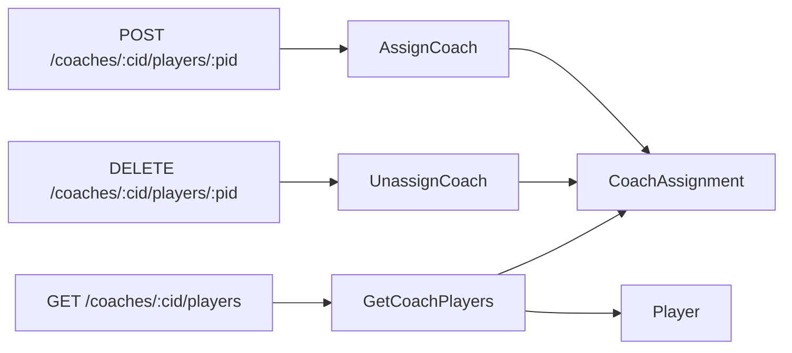

# Coach Assignment

> ← Back to [Module Index](../SPEC.md#capabilities) · Stories: [US-06](../STORIES.md#us-06-admin-operations-journey-assign-and-unassign-coach-to-player), [US-07](../STORIES.md#us-07-public-journey-coach-views-assigned-players), [US-09](../STORIES.md#us-09-error-and-edge-case-journey-coach-operations-failure-modes)

Assign and unassign coaches to players (one active coach per player) and list assigned players.

## Aspect Map

| Aspect    | Concept                                                                                             | Summary                                                            |
| --------- | --------------------------------------------------------------------------------------------------- | ------------------------------------------------------------------ |
| Operation | [AssignCoach](../operations.md#assigncoach)                                                         | Validates coach/player exist, enforces one-active-coach constraint |
| Interface | [POST /coaches/:coachId/players/:playerId](../interfaces.md#post-coachescoachidplayersplayerid)     | `player-management.write.assignCoach` permission                   |
| Mapping   | [AssignCoachRequestToInput](../mappings.md#assigncoachrequesttoinput)                               | URL params → domain input                                          |
| Operation | [UnassignCoach](../operations.md#unassigncoach)                                                     | Sets unassignedAt on the active assignment                         |
| Interface | [DELETE /coaches/:coachId/players/:playerId](../interfaces.md#delete-coachescoachidplayersplayerid) | `player-management.write.unassignCoach` permission                 |
| Mapping   | [UnassignCoachRequestToInput](../mappings.md#unassigncoachrequesttoinput)                           | URL params → domain input                                          |
| Query     | [GetCoachPlayers](../queries.md#getcoachplayers)                                                    | Returns active-assigned players for a coach                        |
| Interface | [GET /coaches/:coachId/players](../interfaces.md#get-coachescoachidplayers)                         | `player-management.read.getCoachPlayers` permission                |

## Flow

## Rules

### AssignCoach

| ID  | Rule                           | Formal                              |
| --- | ------------------------------ | ----------------------------------- |
| R1  | Coach must exist               | `coach(coachId) != null`            |
| R2  | Coach must be active           | `coach.status = ACTIVE`             |
| R3  | Player must exist              | `player(playerId) != null`          |
| R4  | No duplicate active assignment | `activeAssignment(playerId) = null` |

### UnassignCoach

| ID  | Rule                         | Formal                                        |
| --- | ---------------------------- | --------------------------------------------- |
| R1  | Active assignment must exist | `activeAssignment(coachId, playerId) != null` |

### GetCoachPlayers

| ID  | Rule                    | Formal                                                    |
| --- | ----------------------- | --------------------------------------------------------- |
| R1  | Coach must exist        | `coach(coachId) != null`                                  |
| R2  | Coach-scope enforcement | `actor.principalId = coach.principalId OR isAdmin(actor)` |

## Error States

| Condition          | Result                        |
| ------------------ | ----------------------------- |
| AssignCoach R1     | 404 `COACH_NOT_FOUND`         |
| AssignCoach R2     | 409 `COACH_INACTIVE`          |
| AssignCoach R3     | 404 `PLAYER_NOT_FOUND`        |
| AssignCoach R4     | 409 `PLAYER_ALREADY_ASSIGNED` |
| UnassignCoach R1   | 404 `ASSIGNMENT_NOT_FOUND`    |
| GetCoachPlayers R1 | 404 `COACH_NOT_FOUND`         |
| GetCoachPlayers R2 | 403 `FORBIDDEN`               |

## Domain Concepts Used

- [CoachAssignment](../domain.md#coachassignment) — assignment entity with soft-delete
- [Coach](../domain.md#coach) — coach existence and status check
- [Player](../domain.md#player) — player existence check and result set
