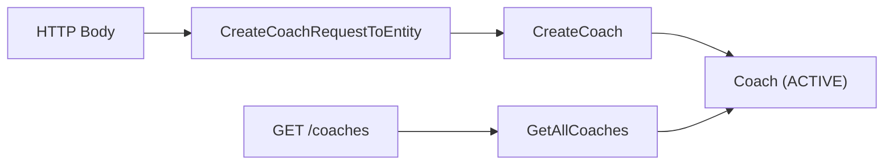

# Coach Lifecycle

> ← Back to [Module Index](../SPEC.md#capabilities) · Stories: [US-05](../STORIES.md#us-05-admin-operations-journey-register-a-new-coach)

Register coach profiles with auth principal binding and list coaches for operations dashboards.

## Aspect Map

| Aspect    | Concept                                                                 | Summary                                           |
| --------- | ----------------------------------------------------------------------- | ------------------------------------------------- |
| Operation | [CreateCoach](../operations.md#createcoach)                             | Validates input, enforces principalId uniqueness  |
| Interface | [POST /coaches](../interfaces.md#post-coaches)                          | `player-management.write.createCoach` permission  |
| Mapping   | [CreateCoachRequestToEntity](../mappings.md#createcoachrequesttoentity) | HTTP body → domain input                          |
| Query     | [GetAllCoaches](../queries.md#getallcoaches)                            | Returns all coach records                         |
| Interface | [GET /coaches](../interfaces.md#get-coaches)                            | `player-management.read.getAllCoaches` permission |

## Flow

## Rules

| ID  | Rule                 | Formal                                 |
| --- | -------------------- | -------------------------------------- |
| R1  | PrincipalId required | `isNonEmptyString(principalId) = true` |
| R2  | Name required        | `isNonEmptyString(name) = true`        |
| R3  | Email required       | `isNonEmptyString(email) = true`       |
| R4  | PrincipalId unique   | `principalId NOT IN active coaches`    |

## Error States

| Condition      | Result                    |
| -------------- | ------------------------- |
| R1–R3 violated | 400 `VALIDATION_ERROR`    |
| R4 violated    | 409 `DUPLICATE_PRINCIPAL` |

## Domain Concepts Used

- [Coach](../domain.md#coach) — created entity
- [CoachStatus](../domain.md#coachstatus) — initial ACTIVE status
