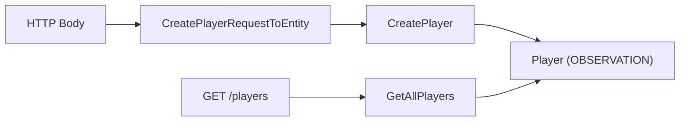

# Create Player

> ← Back to [Module Index](../SPEC.md#capabilities) · Stories: [US-01](../STORIES.md#us-01-admin-operations-journey-register-a-new-player), [US-04](../STORIES.md#us-04-error-and-edge-case-journey-reject-invalid-player-registration-and-unauthorized-access)

Register a new player with identity constraints and financial defaults. Also exposes a flat player list for internal tooling.

## Aspect Map

| Aspect    | Concept                                                                   | Summary                                                                    |
| --------- | ------------------------------------------------------------------------- | -------------------------------------------------------------------------- |
| Operation | [CreatePlayer](../operations.md#createplayer)                             | Validates input, enforces email uniqueness, persists player as OBSERVATION |
| Interface | [POST /players](../interfaces.md#post-players)                            | `player-management.write.createPlayer` permission                          |
| Mapping   | [CreatePlayerRequestToEntity](../mappings.md#createplayerrequesttoentity) | HTTP body → domain input with email normalization                          |
| Query     | [GetAllPlayers](../queries.md#getallplayers)                              | Returns all player records                                                 |
| Interface | [GET /players](../interfaces.md#get-players)                              | `player-management.read.getAllPlayers` permission                          |

## Flow

## Rules

| ID  | Rule                   | Formal                                      |
| --- | ---------------------- | ------------------------------------------- |
| R1  | Name required          | `isNonEmptyString(name) = true`             |
| R2  | Email required         | `isNonEmptyString(email) = true`            |
| R3  | Canonical email unique | `canonicalEmailKey(email) NOT IN existing`  |
| R4  | Limit in allowed set   | `currentLimit IN {NL20, NL25, NL50, NL100}` |
| R5  | Bankroll non-negative  | `bankroll >= 0`                             |
| R6  | Makeup non-negative    | `makeup >= 0`                               |

## Calculations

| ID  | Calculation         | Formula                      |
| --- | ------------------- | ---------------------------- |
| C1  | Canonical email key | `email.trim().toLowerCase()` |
| C2  | Initial status      | `status = OBSERVATION`       |

## Error States

| Condition      | Result                 |
| -------------- | ---------------------- |
| R1–R2 violated | 400 `VALIDATION_ERROR` |
| R3 violated    | 409 `DUPLICATE_EMAIL`  |
| R4 violated    | 400 `VALIDATION_ERROR` |
| R5–R6 violated | 400 `VALIDATION_ERROR` |

## Domain Concepts Used

- [Player](../domain.md#player) — created entity
- [PlayerStatus](../domain.md#playerstatus) — initial OBSERVATION status
