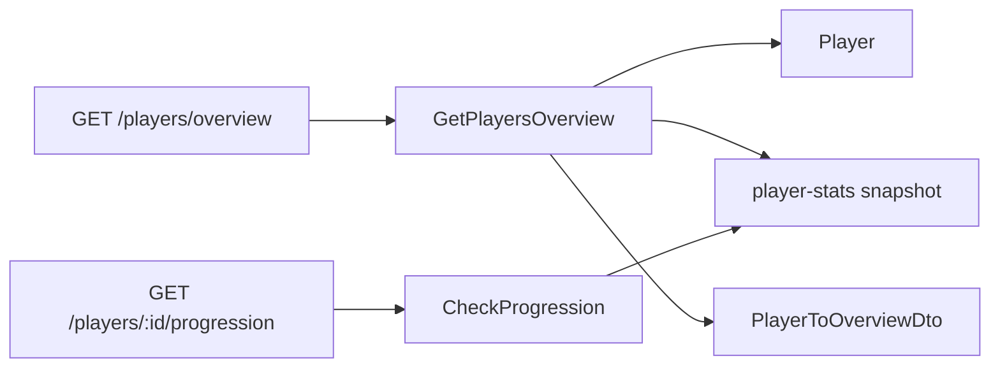

# Players Overview

> ← Back to [Module Index](../SPEC.md#capabilities) · Stories: [US-02](../STORIES.md#us-02-public-journey-view-player-list-and-portfolio-overview), [US-03](../STORIES.md#us-03-cross-feature-integration-player-data-consumed-by-settlement-makeup-and-progression)

30-day and lifetime portfolio projections for dashboard and operations. Also delegates to player-progression for limit promotion readiness.

## Aspect Map

| Aspect       | Concept                                                                                 | Summary                                                      |
| ------------ | --------------------------------------------------------------------------------------- | ------------------------------------------------------------ |
| Query        | [GetPlayersOverview](../queries.md#getplayersoverview)                                  | Joins Player + PlayerStatsSnapshot for rolling metrics       |
| Interface    | [GET /players/overview](../interfaces.md#get-playersoverview)                           | `player-management.read.getPlayersOverview` permission       |
| Mapping      | [PlayerToOverviewDto](../mappings.md#playertooverviewdto)                               | Domain → DTO with computed lifetimeProfit, avgHands, winrate |
| Cross-module | [player-stats.GetPlayerStatsWindow](../../player-stats/queries.md#getplayerstatswindow) | Reads `hands` and `profit` for period calculations           |
| Interface    | [GET /players/:id/progression](../interfaces.md#get-playersidprogression)               | `player-management.read.getPlayerProgression` permission     |
| Cross-module | [player-progression](../../player-progression/SPEC.md)                                  | Delegates to `CheckProgression` operation                    |

## Flow

## Calculations

| ID  | Calculation      | Formula                                                    |
| --- | ---------------- | ---------------------------------------------------------- |
| C1  | Lifetime profit  | `SUM(stats[].profit)`                                      |
| C2  | Avg hands/period | `totalHands / periodDays`                                  |
| C3  | Winrate BB/100   | `computeWinrateBbPer100(totalProfit, totalHands, bbValue)` |

## Domain Concepts Used

- [Player](../domain.md#player) — source entity
- [PlayerToOverviewDto](../mappings.md#playertooverviewdto) — outbound mapping
- [PlayerStatsSnapshot](../../player-stats/domain.md#playerstatssnapshot) — cross-module read
