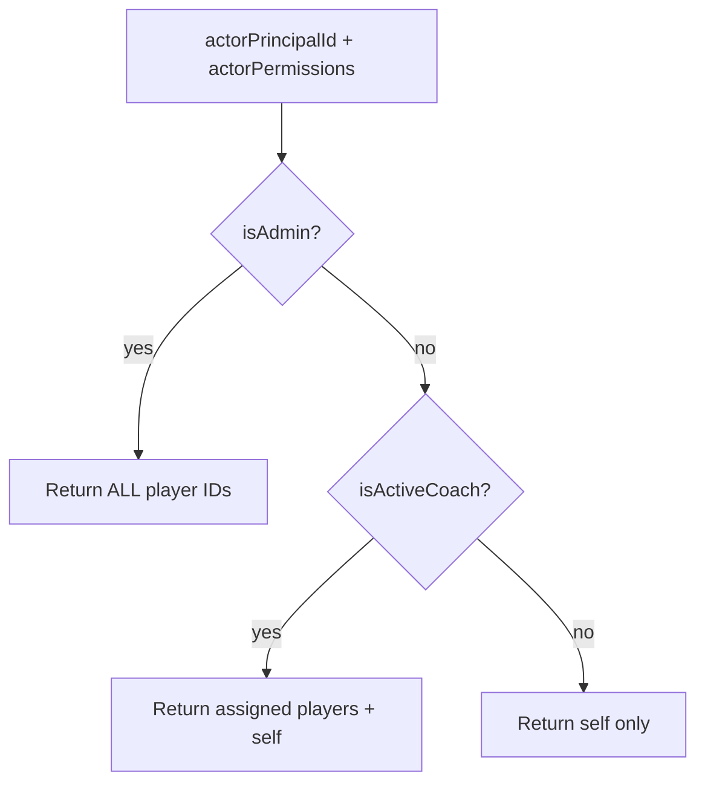

# Resolve Player Visibility

> ← Back to [Module Index](../SPEC.md#capabilities) · Stories: [US-08](../STORIES.md#us-08-cross-feature-integration-player-visibility-through-coach-assignment)

Cross-cutting query determining which players an actor may access. Consumed by makeup, stats, and progression features.

## Aspect Map

| Aspect       | Concept                                                          | Summary                                             |
| ------------ | ---------------------------------------------------------------- | --------------------------------------------------- |
| Query        | [ResolvePlayerVisibility](../queries.md#resolveplayervisibility) | Admin=all, coach=assigned+self, player=self         |
| Cross-module | [player-makeup](../../player-makeup/SPEC.md)                     | Replaces ad-hoc `enforceReadScope` in makeup routes |
| Cross-module | [player-stats](../../player-stats/SPEC.md)                       | Scoped stats access for coaches and players         |

## Resolution Logic

## Priority Rules

| Priority | Condition                                                               | Result                                        |
| -------- | ----------------------------------------------------------------------- | --------------------------------------------- |
| 1        | Actor has `player-management.*.*` or `player-makeup.write.manageMakeup` | All players                                   |
| 2        | Actor is an active coach (matched by `principalId`)                     | Assigned player IDs + self (if also a player) |
| 3        | Default                                                                 | Self player ID only (if exists)               |

## Consumers

| Feature                                      | How Used                                                     |
| -------------------------------------------- | ------------------------------------------------------------ |
| [player-makeup](../../player-makeup/SPEC.md) | `enforceVisibility` middleware on all GET endpoints          |
| [player-stats](../../player-stats/SPEC.md)   | `enforceVisibility` middleware on history + window endpoints |

## Domain Concepts Used

- [CoachAssignment](../domain.md#coachassignment) — active assignments for coach lookup
- [Coach](../domain.md#coach) — principal-to-coach resolution
- [Player](../domain.md#player) — full player list for admin, self-lookup for player
