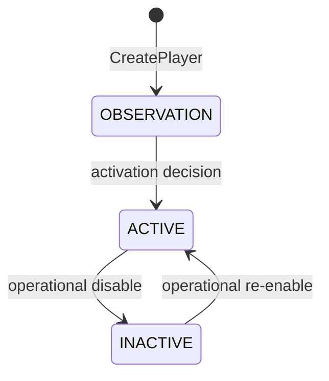
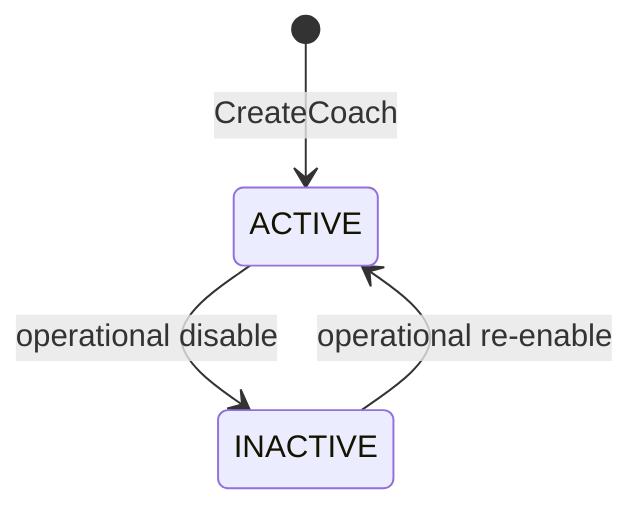
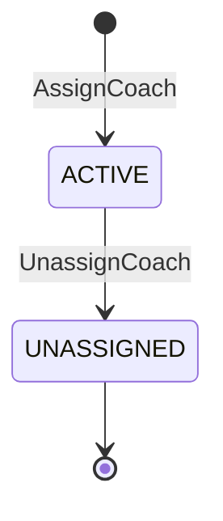

# States: Player Management

## PlayerLifecycle

### Transition Table

| From | Event | To | Guard | Effect |
| ---- | ----- | -- | ----- | ------ |
| [new] | CreatePlayer | OBSERVATION | Create rules R0-R6 pass | Player record persisted |
| OBSERVATION | ActivatePlayer | ACTIVE | Player satisfies operational requirements | Player can fully operate |
| ACTIVE | DeactivatePlayer | INACTIVE | Admin/ops action | New operational writes can be blocked by policy |
| INACTIVE | ReactivatePlayer | ACTIVE | Admin/ops action | Player returns to active operation |

## CoachLifecycle

## CoachAssignmentLifecycle

### Invariants

| ID | Invariant | Formal |
| --- | --------- | ------ |
| I1 | One active coach assignment per player | `count(CoachAssignment where playerId = X and unassignedAt is null) <= 1` |
| I2 | Inactive coach cannot receive new assignments | `Coach.status = INACTIVE -> AssignCoach rejected` |
