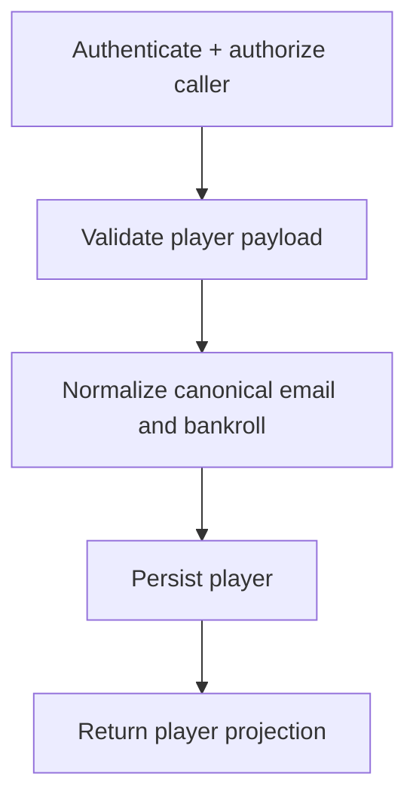
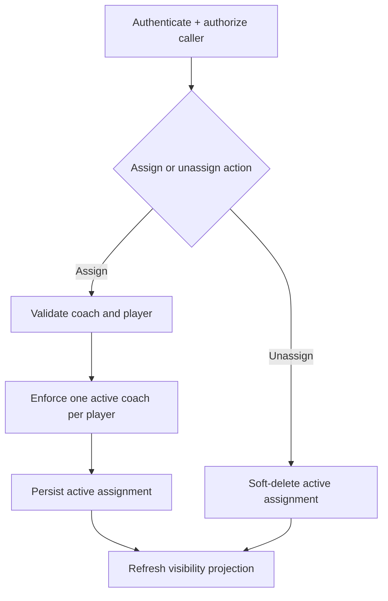

# Workflows: Player Management

## PlayerRegistrationWorkflow

**Type:** Workflow
**Triggers:** `POST /players`
**Orchestrates:** [CreatePlayer](operations.md#createplayer), [GetAllPlayers](queries.md#getallplayers)
**Compensation Strategy:** none
**Idempotency:** no (duplicate canonical email is rejected)

### Steps

## CoachAssignmentWorkflow

**Type:** Workflow
**Triggers:** `POST /coaches/:coachId/players/:playerId`, `DELETE /coaches/:coachId/players/:playerId`
**Orchestrates:** [AssignCoach](operations.md#assigncoach), [UnassignCoach](operations.md#unassigncoach), [ResolvePlayerVisibility](queries.md#resolveplayervisibility)
**Compensation Strategy:** none
**Idempotency:** partial (unassign on non-existent active assignment returns `ASSIGNMENT_NOT_FOUND`)

### Steps

### Invariants

| ID | Invariant | Formal |
| --- | --------- | ------ |
| I1 | Assignment flow preserves one active coach per player | `count(active assignments by playerId) <= 1` |
| I2 | Visibility query must reflect latest assignment state | `ResolvePlayerVisibility(playerId) uses active assignment set` |
