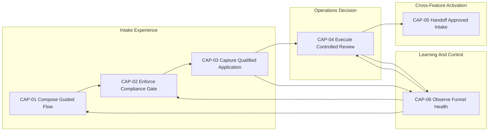
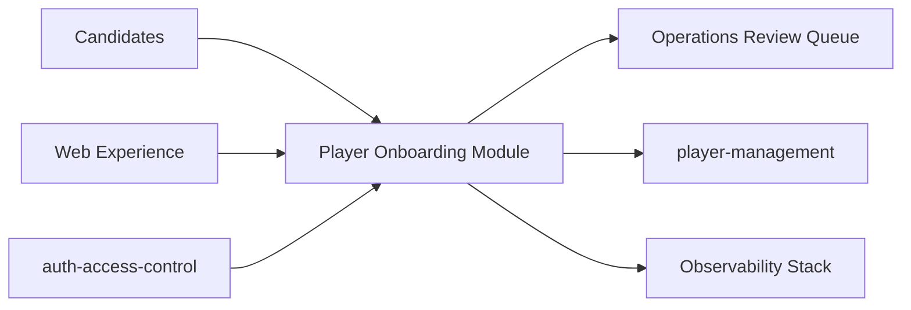
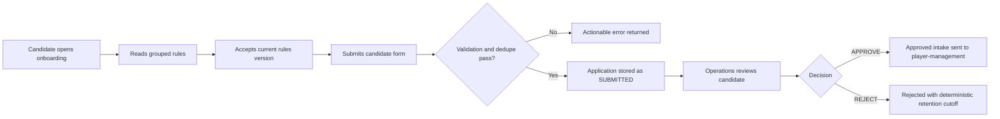

# Epic Point Of View

## Epic headline

From unknown candidate to trusted intake signal.

## Holistic module view

This module is not just a form flow.
It is an intake governance system made of six interlocked capabilities:

- journey composition,
- compliance gating,
- qualified data capture,
- controlled human decision,
- cross-feature activation handoff,
- continuous observability.

If any one capability degrades, the whole module loses trust, throughput, or compliance.

## Why this module exists

Without this module, candidate intake is noisy, non-compliant, and hard to review.
With this module, every application arrives with explicit rules acceptance, mandatory legal consent, and structured data that supports fair manual decisions.

## Plain-language objective

Create a reliable front door for player recruitment.

In practice, this means:
- candidates can only submit after accepting the current rules version;
- operations receives complete, deduplicated applications;
- downstream teams can trust approved records as real onboarding evidence.

## System objective statement

Operate player recruitment intake as a trustworthy end-to-end system that balances:

- candidate clarity,
- legal and policy compliance,
- operational decision quality,
- downstream activation reliability,
- measurable performance over time.

## Epic value proposition

| Audience | Problem today | Value delivered by this module |
| --- | --- | --- |
| Candidate | Confusing process and unclear expectations | Clear steps, predictable feedback, and confirmation of submission |
| Operations reviewer | Incomplete forms and permission ambiguity | Review-ready backlog, controlled permissions, and auditable decisions |
| Player management | Low-trust handoff from intake | Approved applications with deterministic review metadata |
| Leadership | Funnel quality is hard to measure | Conversion, approval, and review-time metrics for governance |

## Module architecture at a glance

## Capability mesh

| Capability | Role in whole module | If it fails |
| --- | --- | --- |
| CAP-01 Compose Guided Flow | Gives candidate structured entry and context | Candidates drop before qualification |
| CAP-02 Enforce Compliance Gate | Prevents non-compliant submissions | Legal and policy risk enters pipeline |
| CAP-03 Capture Qualified Application | Produces clean review-ready records | Operations backlog quality collapses |
| CAP-04 Execute Controlled Review | Finalizes decisions with governance | Invalid decisions and lifecycle drift |
| CAP-05 Handoff Approved Intake | Activates approved records downstream | Player creation pipeline loses trust |
| CAP-06 Observe Funnel Health | Detects quality, speed, and risk signals | Team flies blind and reacts late |

## What the module does

1. Composes onboarding flow screens and grouped rule sections.
2. Enforces acceptance gate before form submission.
3. Validates input data, blocks duplicates, and persists `SUBMITTED` applications.
4. Enables authenticated manual decision (`APPROVE` or `REJECT`).
5. Emits events and read models used by operations and player-management.

## Whole-module boundaries

### Inputs the module accepts

- candidate onboarding traffic,
- candidate compliance and profile data,
- reviewer decisions.

### Outputs the module guarantees

- deterministic submission confirmation and backlog visibility,
- deterministic reviewed outcomes,
- deterministic approved intake handoff,
- telemetry for governance and optimization.

## Shared rules (module-wide authority)

Shared rules are defined at epic scope and apply across capabilities.
Canonical IDs below are reused exactly from the feature specs.

| Canonical reference | Rule statement | Applies to | Source aspect |
| --- | --- | --- | --- |
| CandidateOnboardingFlow.I1 | Form cannot be submitted without rules acceptance. | CAP-01, CAP-02, CAP-03 | workflows.md |
| SubmitCandidateApplication.R1 | Rules acceptance version and timestamp are mandatory. | CAP-02, CAP-03 | operations.md |
| SubmitCandidateApplication.R2 | LGPD consent is mandatory. | CAP-02, CAP-03 | operations.md |
| SubmitCandidateApplication.R5 | Duplicate by canonical email or WhatsApp must be blocked. | CAP-03, CAP-06 | operations.md |
| ReviewCandidateApplication.R1 | Review mutation requires authentication and authorization. | CAP-04 | operations.md |
| ReviewCandidateApplication.P6 | Approved decisions publish deterministic intake handoff. | CAP-04, CAP-05 | operations.md |
| CandidateApplicationLifecycle.I1 | Closed states cannot return to active states. | CAP-04, CAP-06 | states.md |
| CandidateApplicationLifecycle.I2 | Submitted/reviewed applications must include rules acceptance evidence. | CAP-02, CAP-03, CAP-06 | states.md |
| CandidateApplicationLifecycle.I3 | Submitted/reviewed applications must include LGPD consent evidence. | CAP-02, CAP-03, CAP-06 | states.md |

### CandidateOnboardingFlow.I1

Flow-level gate: rules acceptance is required before submission can proceed.

### SubmitCandidateApplication.R1 and SubmitCandidateApplication.R2

Submission-level compliance gates: accepted regulation metadata and LGPD consent are mandatory.

### SubmitCandidateApplication.R5

Submission-level duplicate defense: block repeated candidate intake using canonical email and WhatsApp.

### ReviewCandidateApplication.R1 and ReviewCandidateApplication.P6

Review governance and activation guarantee: review is fail-closed by authorization and approved outcomes must produce deterministic handoff.

### CandidateApplicationLifecycle.I1, CandidateApplicationLifecycle.I2, CandidateApplicationLifecycle.I3

Lifecycle integrity guarantees: terminal-state irreversibility and continuous compliance evidence across submitted/reviewed states.

## External ecosystem view

## Governance and risk posture

| Area | Posture |
| --- | --- |
| Authentication and authorization | Fail closed for review actions |
| Compliance gates | Strict mandatory enforcement |
| Duplicate protection | Deterministic block before persistence |
| Lifecycle integrity | Terminal states are irreversible |
| Observability | Coverage and drift checked continuously |

## Module boundaries

### In scope

- Public onboarding flow contract (`GET /onboarding/flow`, `POST /onboarding/candidates`).
- Admin review contract (`PATCH /onboarding/candidates/{id}/review`, review queries).
- Submission and review lifecycle (`SUBMITTED`, `UNDER_REVIEW`, `APPROVED`, `REJECTED`).
- Deterministic handoff signal for approved candidates.

### Out of scope

- Player account creation.
- Recruiting campaign generation.
- Automated review scoring.

## Epic operating narrative

## North-star success criteria

- Submission quality is high: low validation and duplicate failure ratio.
- Review speed is predictable: stable time-to-review.
- Approval signal is trustworthy: approved handoff data is complete and consistent.
- Feedback loop is active: funnel and compliance signals drive weekly improvements.
