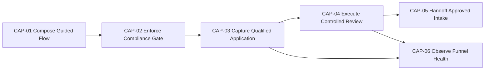

# Capability Map

This module is organized by capabilities, not by pages or endpoints.
Each capability produces a measurable business outcome.
Each capability is fully documented in its own self-contained file.
Operation rules are owned in capability files; shared module-wide rules are owned in `01-EPIC-POINT-OF-VIEW.md`.

## Capability chain

## Capability atlas index

| Capability ID | Capability name | Self-contained file | Market stage | Outcome owned |
| --- | --- | --- | --- | --- |
| CAP-01 | Compose Guided Onboarding Flow | [CAP-01-COMPOSE-GUIDED-ONBOARDING-FLOW.md](capabilities/CAP-01-COMPOSE-GUIDED-ONBOARDING-FLOW.md) | Acquire | Candidate sees rules and onboarding context in clear sequence |
| CAP-02 | Enforce Compliance Gate | [CAP-02-ENFORCE-COMPLIANCE-GATE.md](capabilities/CAP-02-ENFORCE-COMPLIANCE-GATE.md) | Qualify | Submission allowed only with rules acceptance and LGPD consent |
| CAP-03 | Capture Qualified Application | [CAP-03-CAPTURE-QUALIFIED-APPLICATION.md](capabilities/CAP-03-CAPTURE-QUALIFIED-APPLICATION.md) | Qualify | Valid and deduplicated application persisted as SUBMITTED |
| CAP-04 | Execute Controlled Review | [CAP-04-EXECUTE-CONTROLLED-REVIEW.md](capabilities/CAP-04-EXECUTE-CONTROLLED-REVIEW.md) | Decide | Authorized reviewer closes lifecycle deterministically |
| CAP-05 | Handoff Approved Intake | [CAP-05-HANDOFF-APPROVED-INTAKE.md](capabilities/CAP-05-HANDOFF-APPROVED-INTAKE.md) | Activate | Approved output is consumable by player-management |
| CAP-06 | Observe Funnel Health | [CAP-06-OBSERVE-FUNNEL-HEALTH.md](capabilities/CAP-06-OBSERVE-FUNNEL-HEALTH.md) | Optimize | Conversion, compliance, and latency signals drive tuning |

## Capability dependency matrix

| From | Depends on | Dependency type | Why |
| --- | --- | --- | --- |
| CAP-02 | CAP-01 | experience prerequisite | Compliance gate relies on flow exposing acceptance context |
| CAP-03 | CAP-02 | policy prerequisite | Capture can only execute after compliance pass |
| CAP-04 | CAP-03 | data prerequisite | Review requires persisted submitted applications |
| CAP-05 | CAP-04 | decision prerequisite | Handoff occurs only from approved review outcomes |
| CAP-06 | CAP-03, CAP-04 | telemetry prerequisite | Funnel health depends on submission and review signals |

## Capability to market-stage mapping

| Market stage | Goal | Supporting capabilities | Why it matters |
| --- | --- | --- | --- |
| Acquire | Convert interest into started onboarding sessions | CAP-01 | Clear entry point reduces early abandonment |
| Qualify | Ensure compliant and complete applications | CAP-02, CAP-03 | Intake quality avoids operational waste |
| Decide | Reach controlled and timely manual decision | CAP-04 | Fast and auditable decision cycle |
| Activate | Feed approved candidates to next lifecycle | CAP-05 | Onboarding converts into actionable player pipeline |
| Optimize | Improve funnel quality with evidence | CAP-06 | Product and operations iterate using data |

## Capability health dashboard blueprint

| Capability ID | Primary metric | Guardrail metric | Suggested alert |
| --- | --- | --- | --- |
| CAP-01 | `http.server.request.duration` for flow endpoint | Flow error rate | Availability < 99.9% |
| CAP-02 | Rule violations SubmitCandidateApplication.R1 and SubmitCandidateApplication.R2 | Form unlock attempts before acceptance | SubmitCandidateApplication.R1 and SubmitCandidateApplication.R2 violations > 5% |
| CAP-03 | `business.applications_submitted` | Duplicate block ratio SubmitCandidateApplication.R5 | Duplicate spikes over baseline |
| CAP-04 | `business.time_to_review` | Review authorization failures | p50 review time > 48h |
| CAP-05 | Approved-to-handoff success | Missing handoff fields | Any missing handoff payload field |
| CAP-06 | Funnel conversion and drop-off | Metric coverage drift | Coverage below expected thresholds |
