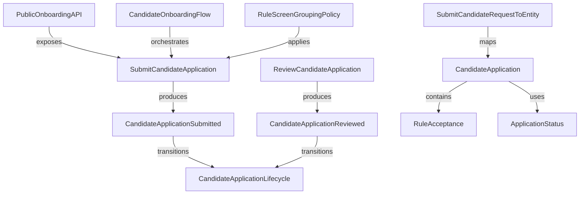
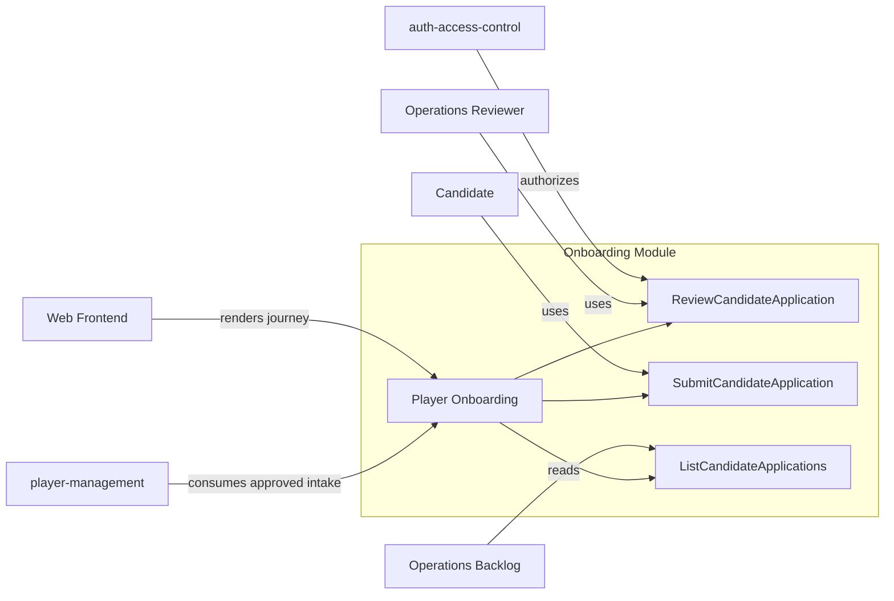

# Concept Relations

This map shows how concepts connect inside the player onboarding module and across module boundaries.

## Internal concept map

## Internal relation table

| From | Edge | To | Why it matters |
| --- | --- | --- | --- |
| PublicOnboardingAPI | exposes | SubmitCandidateApplication | Public submission contract |
| CandidateOnboardingFlow | orchestrates | SubmitCandidateApplication | User journey execution |
| SubmitCandidateRequestToEntity | maps | CandidateApplication | Input normalization and field mapping |
| RuleScreenGroupingPolicy | applies | SubmitCandidateApplication | Readability and acceptance gate support |
| SubmitCandidateApplication | produces | CandidateApplicationSubmitted | Submission audit and event propagation |
| CandidateApplicationSubmitted | transitions | CandidateApplicationLifecycle | Lifecycle starts in `SUBMITTED` |
| ReviewCandidateApplication | produces | CandidateApplicationReviewed | Decision trace and downstream handoff |
| CandidateApplicationReviewed | transitions | CandidateApplicationLifecycle | Lifecycle closes to terminal state |
| CandidateApplication | contains | RuleAcceptance | Compliance evidence is embedded |
| CandidateApplication | uses | ApplicationStatus | Deterministic status model |

## External concept map

## Cross-boundary relationship table

| Source concept | Edge | External concept/module | Contract type | Evidence |
| --- | --- | --- | --- | --- |
| ReviewCandidateApplication | depends-on | auth-access-control | Authorization permission checks | `../SPEC.md` cross-feature dependencies, `../interfaces.md` |
| CandidateApplicationReviewed | produces-for | player-management | Approved intake handoff | `../SPEC.md` produces-for, `../events.md` |
| PublicOnboardingAPI | consumed-by | web | Public onboarding UX journey | `../SPEC.md` produces-for, `../interfaces.md` |
| ListCandidateApplications | consumed-by | operations | Manual review backlog | `../queries.md`, `../interfaces.md` |

## Relationship integrity checklist

- Every exposed mutation operation has explicit rule and error semantics.
- Every lifecycle transition is traceable to an operation or event.
- Every cross-module dependency has a named contract path.
- Approved output is explicitly tied to player-management intake.
