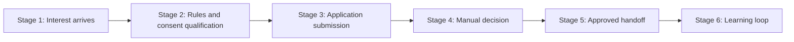

# Market Methodology

This module can be managed as a market-facing capability system, not only as a backend flow.

## Methodology stack used

| Method | Why it is used here | How it maps to this module |
| --- | --- | --- |
| Business capability mapping (BIZBOK family) | Keeps the design stable even if teams or channels change | CAP-01 to CAP-06 capability model |
| Process taxonomy (APQC style) | Standardizes repeatable operational flow language | Acquire -> Qualify -> Decide -> Activate pipeline |
| Governance control objectives (COBIT style) | Clarifies ownership and audit intent | Authz gates, decision traceability, lifecycle controls |
| Risk profile controls (NIST CSF style) | Makes failure modes and controls explicit | Duplicate abuse, unauthorized review, telemetry drift |
| Relationship modeling (ArchiMate-style thinking) | Improves cross-module reasoning | Internal and external relation maps in `04-CONCEPT-RELATIONS.md` |

## Market-facing journey model

This module starts after traffic acquisition and before player account creation.

## Stage-by-stage operating model

| Stage | Market intent | Module capability | Primary metric | Main risk |
| --- | --- | --- | --- | --- |
| Stage 1 Interest arrives | Capture candidate attention into onboarding start | CAP-01 | Flow starts per day | UX drop before rules read |
| Stage 2 Qualification | Ensure legal/compliance prerequisites | CAP-02 | SubmitCandidateApplication.R1 and SubmitCandidateApplication.R2 pass rate | Consent bypass or weak gate |
| Stage 3 Submission | Convert qualified interest into structured application | CAP-03 | Successful submissions | Duplicate and low-quality data |
| Stage 4 Decision | Close loop with controlled operational judgment | CAP-04 | Time to review, approval ratio | Backlog accumulation |
| Stage 5 Handoff | Send reliable approved intake to next module | CAP-05 | Handoff completeness | Missing fields for downstream use |
| Stage 6 Learning loop | Improve funnel quality over time | CAP-06 | Conversion trend and violation trend | Observability blind spots |

## KPI design

### North-star and guardrails

| Metric class | Metric | Why it matters | Suggested target |
| --- | --- | --- | --- |
| North-star | Qualified submission volume | Indicates market pull with compliance quality | Positive trend with stable rejection profile |
| Efficiency | Time to review | Measures operational throughput and candidate experience | p50 < 24h, p95 < 72h |
| Quality | Approval rate | Balances intake quality and funnel strictness | 30% to 70% rolling band |
| Risk | Duplicate blocked rate | Detects abuse or communication gaps | Stable baseline with controlled spikes |
| Compliance | SubmitCandidateApplication.R1 and SubmitCandidateApplication.R2 violation rates | Detects gate failures in UX or API usage | < 5% each |

### Alerting priorities

| Priority | Trigger | Recommended response |
| --- | --- | --- |
| P0 | Invariant violation or invalid lifecycle transition | Immediate incident and release hold |
| P1 | Missing required telemetry on critical operations | Fix instrumentation before scaling |
| P2 | Sustained backlog growth or conversion collapse | Investigate process bottlenecks and onboarding UX |

## Market experiments backlog

| Experiment ID | Hypothesis | Capability touched | Success signal |
| --- | --- | --- | --- |
| EXP-01 | Smaller grouped rule screens increase completion | CAP-01 and CAP-02 | Higher accepted-to-start ratio |
| EXP-02 | Better duplicate messaging reduces repeated submissions | CAP-03 | Lower repeated 409 attempts per candidate |
| EXP-03 | Review queue prioritization reduces wait times | CAP-04 | Lower p95 time to review |
| EXP-04 | Structured approved handoff checklist reduces downstream rework | CAP-05 | Fewer player-management correction loops |

## Governance cadence

| Cadence | Participants | Agenda |
| --- | --- | --- |
| Weekly | Operations + Product + Engineering | KPI review, risk signals, open decisions |
| Biweekly | Engineering + Observability owner | Telemetry coverage and alert tuning |
| Monthly | Leadership + cross-feature owners | Funnel health, dependency alignment, release posture |
