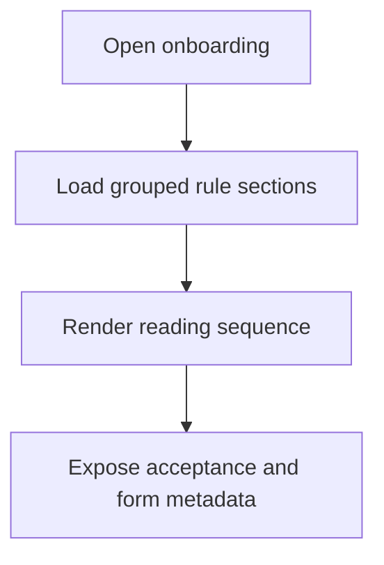

# CAP-01 Compose Guided Onboarding Flow

## Capability card

| Field | Value |
| --- | --- |
| Capability ID | CAP-01 |
| Market stage | Acquire |
| Primary owner | operations-core |
| Technical owner | web-core |
| Primary interface | GET /onboarding/flow |

## Objective in plain language

Show the candidate the right onboarding content in the right order, with rules first and form context second.

## User promise

When a candidate opens onboarding, the experience is readable, structured, and ready for compliant progression.

## Trigger and output

| Item | Definition |
| --- | --- |
| Trigger | Public access to onboarding journey |
| Output | Flow payload with regulation version, grouped sections, and acceptance requirements |

## Self-contained flow

## Rules and constraints owned by this capability

| Canonical reference | Constraint | Why |
| --- | --- | --- |
| CandidateOnboardingFlow.I1 | Form cannot be submitted without rules acceptance. | Prevents premature submission before compliance step |
| CandidateOnboardingFlow.I2 | Persisted applications must include LGPD consent. | Preserves legal baseline in the journey contract |
| RuleScreenGroupingPolicy decision table | Group/split rule screens by readability and viewport conditions. | Reduces cognitive overload and mobile friction |

## Shared rules referenced from epic

See [01-EPIC-POINT-OF-VIEW.md](../01-EPIC-POINT-OF-VIEW.md) shared-rule authority:

- CandidateOnboardingFlow.I1
- CandidateApplicationLifecycle.I2
- CandidateApplicationLifecycle.I3

## Policy configuration

| Parameter | Default | Behavior |
| --- | --- | --- |
| maxContentTokensPerScreen | 900 | Avoids long rule screens |
| enforceAcceptanceGate | true | Enables strict flow-to-form gating |
| requireProgressIndicator | true | Shows progress through rules |

## Interface contract snapshot

| Endpoint | Contract |
| --- | --- |
| GET /onboarding/flow | Returns regulationVersion, groups, acceptanceRequired=true, lgpdConsentRequired=true |

## Concepts and relations

| Concept | Relation | Related concept |
| --- | --- | --- |
| RuleScreenGroupingPolicy | applies | CandidateOnboardingFlow |
| CandidateOnboardingFlow | orchestrates | SubmitCandidateApplication |
| PublicOnboardingAPI | exposes | CandidateOnboardingFlow payload |

## Dependencies

| Type | Dependency | Reason |
| --- | --- | --- |
| Internal | workflows and interfaces | Defines sequence and payload |
| External | web frontend | Renders grouped journey to candidates |

## KPI and alerts

| Metric | Target | Alert |
| --- | --- | --- |
| Flow availability | >= 99.9% | Below 99.9% |
| Flow p99 latency | <= 200ms | Above 200ms sustained |
| Read-to-accept progression | Stable upward trend | Sudden drop indicates UX friction |

## Failure modes

| Failure | Candidate impact | Response |
| --- | --- | --- |
| Flow endpoint unavailable | Onboarding cannot start | Incident and fallback messaging |
| Grouping too dense | Drop before acceptance | Rebalance policy and content slicing |

## Source anchors

- ../workflows.md
- ../interfaces.md
- ../SPEC.md
