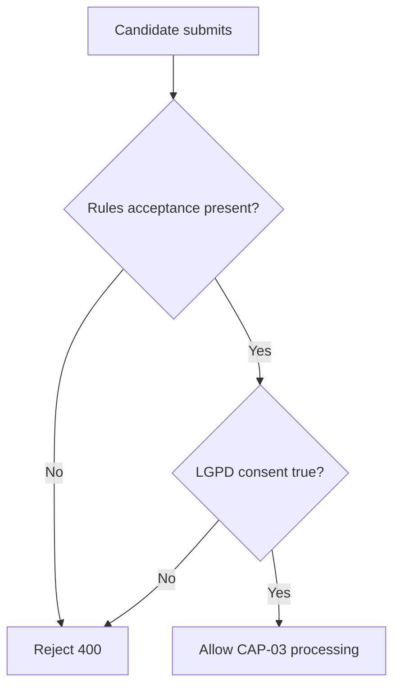

# CAP-02 Enforce Compliance Gate

## Capability card

| Field | Value |
| --- | --- |
| Capability ID | CAP-02 |
| Market stage | Qualify |
| Primary owner | operations-core |
| Technical owner | backend-core |
| Primary interface | POST /onboarding/candidates |

## Objective in plain language

Guarantee that no candidate application is accepted unless compliance prerequisites are explicitly satisfied.

## User promise

Submission is only possible after clear consent and rules acknowledgment.

## Trigger and output

| Item | Definition |
| --- | --- |
| Trigger | Candidate attempts submission |
| Output | Gate decision: pass to validation and persistence or return deterministic rejection |

## Self-contained gate logic

## Rules owned by this capability

| Canonical reference | Rule | Error on fail |
| --- | --- | --- |
| SubmitCandidateApplication.R1 | acceptedRegulationVersion and acceptedRegulationAt are mandatory | 400 |
| SubmitCandidateApplication.R2 | lgpdConsentAccepted must be true | 400 |

## Shared rules referenced from epic

See [01-EPIC-POINT-OF-VIEW.md](../01-EPIC-POINT-OF-VIEW.md) shared-rule authority:

- CandidateOnboardingFlow.I1
- CandidateApplicationLifecycle.I2
- CandidateApplicationLifecycle.I3

## Input and output contract

| Input field | Required | Purpose |
| --- | --- | --- |
| acceptedRegulationVersion | yes | Captures version acknowledged |
| acceptedRegulationAt | yes | Captures acceptance timestamp |
| lgpdConsentAccepted | yes | Captures explicit legal consent |

| Output state | Meaning |
| --- | --- |
| Gate pass | Candidate can proceed to full validation and persistence |
| Gate fail | Candidate receives structured 400 error |

## Dependencies

| Type | Dependency | Reason |
| --- | --- | --- |
| Internal | SubmitCandidateApplication rules | Enforces compliance before data write |
| External | legal/policy ownership | LGPD and terms acceptance governance |

## KPI and alerts

| Metric | Target | Alert |
| --- | --- | --- |
| SubmitCandidateApplication.R1 violation rate | < 5% | > 5% indicates weak acceptance UX |
| SubmitCandidateApplication.R2 violation rate | < 5% | > 5% indicates weak consent UX |
| CandidateApplicationLifecycle.I2/I3 violations | 0 | Any value > 0 is P0 |

## Failure modes

| Failure | Business impact | Response |
| --- | --- | --- |
| Acceptance gate bypass | Non-compliant data enters pipeline | Block release and fix gate path |
| Consent captured ambiguously | Legal risk | Freeze rollout until policy correction |

## Source anchors

- ../operations.md
- ../states.md
- ../SPEC.md
