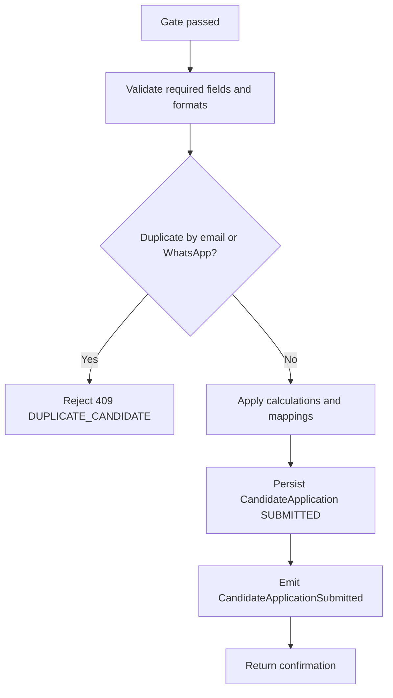

# CAP-03 Capture Qualified Application

## Capability card

| Field | Value |
| --- | --- |
| Capability ID | CAP-03 |
| Market stage | Qualify |
| Primary owner | operations-core |
| Technical owner | backend-core |
| Primary interface | POST /onboarding/candidates |

## Objective in plain language

Convert a compliant submission into a complete, deduplicated, review-ready application.

## User promise

If candidate data is valid and unique, the system confirms submission and creates a reliable review record.

## Trigger and output

| Item | Definition |
| --- | --- |
| Trigger | Compliance gate passed and submission received |
| Output | CandidateApplication persisted as SUBMITTED and CandidateApplicationSubmitted emitted |

## Self-contained flow

## Rules owned by this capability

| Canonical reference | Rule | Error on fail |
| --- | --- | --- |
| SubmitCandidateApplication.R3 | Required fields must exist and be non-empty | 400 |
| SubmitCandidateApplication.R4 | Email format must be valid | 400 |
| SubmitCandidateApplication.R5 | Duplicate by canonical email or WhatsApp is blocked | 409 DUPLICATE_CANDIDATE |
| SubmitCandidateApplication.R6 | At least one preferred time window is required | 400 |
| SubmitCandidateApplication.R7 | trackerDetail is required when trackerUsage is YES or OTHER | 400 |
| SubmitCandidateApplication.R8 | cityState must match City/State format | 400 |
| SubmitCandidateApplication.R9 | Candidate age must be >= 18 | 400 |

## Shared rules referenced from epic

See [01-EPIC-POINT-OF-VIEW.md](../01-EPIC-POINT-OF-VIEW.md) shared-rule authority:

- SubmitCandidateApplication.R5
- CandidateApplicationLifecycle.I2
- CandidateApplicationLifecycle.I3

## Calculations and postconditions

| Item | Definition |
| --- | --- |
| C1 | canonicalEmail = lowercase(trim(email)) |
| C2 | status = SUBMITTED |
| P1 | Persisted state is SUBMITTED |
| P2 | ruleAcceptance is stored with version and timestamp |
| P3 | Application is queryable in review backlog |
| P4 | CandidateApplicationSubmitted emitted deterministically |

## Concepts and state effects

| Concept | Role |
| --- | --- |
| CandidateApplication | Main persisted entity |
| RuleAcceptance | Embedded compliance evidence |
| CandidateApplicationLifecycle | Starts at SUBMITTED |
| CandidateApplicationSubmitted | Submission event contract |

## Dependencies

| Type | Dependency | Reason |
| --- | --- | --- |
| Internal | mappings, states, events, queries | Guarantees deterministic write behavior |
| External | operations backlog consumer | Makes submitted candidate visible for manual review |

## KPI and alerts

| Metric | Target | Alert |
| --- | --- | --- |
| Submission success rate | Stable and improving | Sudden drop |
| Duplicate block rate | Controlled baseline | Unexpected spikes |
| Validation failure distribution | Balanced and explainable | Concentrated spikes by one rule |

## Failure modes

| Failure | Business impact | Response |
| --- | --- | --- |
| Duplicate miss | Queue pollution and reviewer waste | Patch duplicate key checks |
| Missing acceptance persistence | Compliance drift | Block release and backfill audit |
| Wrong initial status | Lifecycle inconsistency | Hotfix status assignment |

## Source anchors

- ../operations.md
- ../mappings.md
- ../states.md
- ../events.md
- ../queries.md
