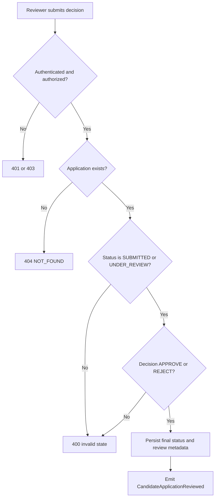

# CAP-04 Execute Controlled Review

## Capability card

| Field | Value |
| --- | --- |
| Capability ID | CAP-04 |
| Market stage | Decide |
| Primary owner | operations-core |
| Technical owner | backend-core |
| Primary interface | PATCH /onboarding/candidates/{id}/review |

## Objective in plain language

Allow authorized reviewers to make final candidate decisions with strict lifecycle correctness and auditability.

## User promise

Reviewers can decide confidently, and every decision is controlled, traceable, and consistent.

## Trigger and output

| Item | Definition |
| --- | --- |
| Trigger | Reviewer issues approve or reject decision |
| Output | Application transitions to APPROVED or REJECTED with review metadata |

## Self-contained flow

## Rules owned by this capability

| Canonical reference | Rule | Error on fail |
| --- | --- | --- |
| ReviewCandidateApplication.R1 | Reviewer must be authenticated and authorized | 401 or 403 |
| ReviewCandidateApplication.R2 | Application must exist | 404 |
| ReviewCandidateApplication.R3 | Only SUBMITTED or UNDER_REVIEW can be decided | 400 |
| ReviewCandidateApplication.R4 | Decision must be APPROVE or REJECT | 400 |

## Shared rules referenced from epic

See [01-EPIC-POINT-OF-VIEW.md](../01-EPIC-POINT-OF-VIEW.md) shared-rule authority:

- ReviewCandidateApplication.R1
- ReviewCandidateApplication.P6
- CandidateApplicationLifecycle.I1

## Calculations and postconditions

| Item | Definition |
| --- | --- |
| C1 | nextStatus = APPROVED if approve, else REJECTED |
| C2 | retentionUntil = reviewedAt + 365d only for reject |
| P1 | Final status persisted deterministically |
| P2 | reviewedAt always populated |
| P3 | reviewDecisionNote stored when provided |
| P4 | Rejection retention behavior deterministic |

## Concepts and relations

| Concept | Relation | Related concept |
| --- | --- | --- |
| ReviewCandidateApplication | transitions | CandidateApplicationLifecycle |
| ReviewCandidateApplication | produces | CandidateApplicationReviewed |
| ListCandidateApplications | supports | reviewer backlog operations |

## Dependencies

| Type | Dependency | Reason |
| --- | --- | --- |
| Internal | states, events, queries | Maintains deterministic decision lifecycle |
| External | auth-access-control | Enforces review permissions |

## KPI and alerts

| Metric | Target | Alert |
| --- | --- | --- |
| Time to review | p50 < 24h, p95 < 72h | p50 > 48h |
| Unauthorized review attempts | Low and explainable | Sustained spike |
| Invalid transition count | 0 | Any increment is P0 |

## Failure modes

| Failure | Business impact | Response |
| --- | --- | --- |
| Unauthorized decisions accepted | Governance breach | Fail closed and incident response |
| Review on terminal state | Lifecycle corruption | Enforce stricter state guard |
| Retention cutoff not set on reject | Data governance drift | Correct calculation and backfill |

## Source anchors

- ../operations.md
- ../states.md
- ../interfaces.md
- ../events.md
- ../queries.md
