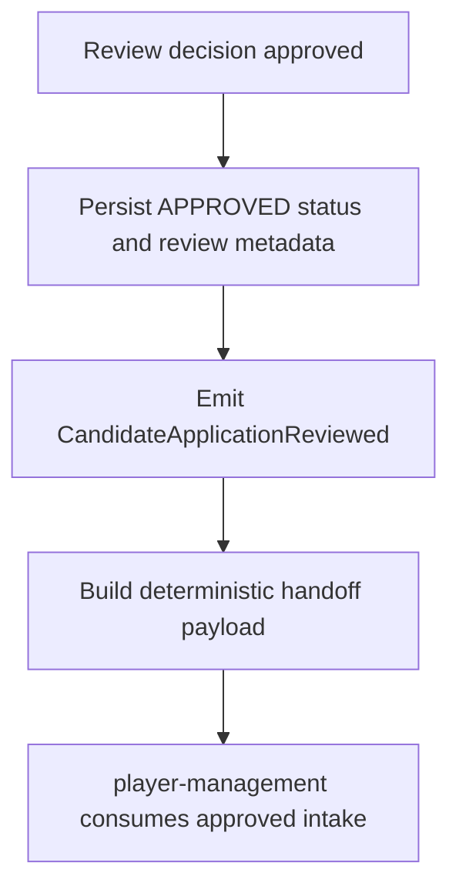

# CAP-05 Handoff Approved Intake

## Capability card

| Field | Value |
| --- | --- |
| Capability ID | CAP-05 |
| Market stage | Activate |
| Primary owner | operations-core |
| Technical owner | backend-core |
| Primary interface | CandidateApplicationReviewed consumption for approved records |

## Objective in plain language

Turn approved review output into a trusted intake signal that downstream player management can act on without re-validation loops.

## User promise

When a candidate is approved, downstream teams receive a complete and deterministic handoff payload.

## Trigger and output

| Item | Definition |
| --- | --- |
| Trigger | Review decision = APPROVE |
| Output | Approved application handoff payload and review event trace |

## Self-contained flow

## Rules and constraints owned by this capability

| Canonical reference | Constraint | Consequence on fail |
| --- | --- | --- |
| ReviewCandidateApplication.P6 | Approved decisions must publish deterministic intake handoff for player-management. | Activation contract breach |
| CandidateApplicationReviewed payload contract | Handoff payload must include identity and review metadata fields. | Downstream rework and rejection |
| CandidateApplicationReviewed produced-by contract | Event emission and persisted decision state must stay consistent. | Cross-feature drift |

## Shared rules referenced from epic

See [01-EPIC-POINT-OF-VIEW.md](../01-EPIC-POINT-OF-VIEW.md) shared-rule authority:

- ReviewCandidateApplication.P6
- CandidateApplicationLifecycle.I1

## Required handoff data

| Data group | Minimum fields |
| --- | --- |
| Candidate identity | applicationId, canonicalEmail |
| Review decision | decision, nextStatus, reviewedAt, reviewedBy |
| Compliance context | acceptedRegulationVersion, acceptedRegulationAt |

## Dependencies

| Type | Dependency | Reason |
| --- | --- | --- |
| Internal | review operation and reviewed event | Supplies approved record and metadata |
| External | player-management | Consumes approved intake for next flow |

## KPI and alerts

| Metric | Target | Alert |
| --- | --- | --- |
| Approved handoff completeness | 100% required fields present | Any missing field |
| Approved-to-consumed latency | Within agreed SLA | Sustained latency increase |
| Handoff failures | Near zero | Any repeated failure pattern |

## Failure modes

| Failure | Business impact | Response |
| --- | --- | --- |
| Missing approved payload fields | Downstream manual reconciliation | Add payload validation and release gate |
| Event-state mismatch | Inconsistent cross-feature behavior | Reconcile event and persistence logic |
| Consumer lag grows | Activation bottleneck | Investigate queue and consumer path |

## Source anchors

- ../events.md
- ../operations.md
- ../SPEC.md
