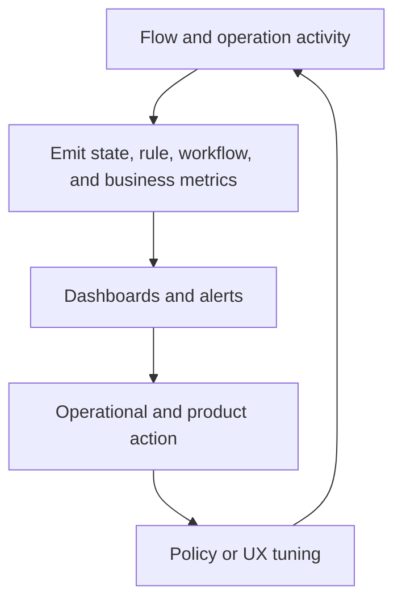

# CAP-06 Observe Funnel Health

## Capability card

| Field | Value |
| --- | --- |
| Capability ID | CAP-06 |
| Market stage | Optimize |
| Primary owner | operations-core |
| Technical owner | web-core and backend-core |
| Primary interface | Telemetry and observability reports |

## Objective in plain language

Make onboarding performance and risk visible enough to improve quality, speed, and compliance over time.

## User promise

Leaders and operators can see where candidates drop, where reviews slow down, and where policy risk appears.

## Trigger and output

| Item | Definition |
| --- | --- |
| Trigger | Runtime flow events, operation calls, and lifecycle transitions |
| Output | Metrics, alerts, and periodic alignment reports |

## Self-contained observability loop

## Metrics owned by this capability

| Metric family | What it answers |
| --- | --- |
| State transition and invariant monitors | Is lifecycle logic behaving correctly? |
| Operation invocation and duration | Are write paths healthy and fast enough? |
| Rule violation counters | Which rules create friction or reveal abuse? |
| Workflow completion and duration | Where does journey abandonment happen? |
| Business KPIs | Are we converting, approving, and reviewing at healthy levels? |

## Shared rules referenced from epic

See [01-EPIC-POINT-OF-VIEW.md](../01-EPIC-POINT-OF-VIEW.md) shared-rule authority:

- CandidateApplicationLifecycle.I1
- CandidateApplicationLifecycle.I2
- CandidateApplicationLifecycle.I3
- SubmitCandidateApplication.R5

## Key KPI set

| KPI | Target band | Operational meaning |
| --- | --- | --- |
| Applications submitted | Positive weekly trend | Funnel demand and intake volume |
| Approval rate | 30% to 70% rolling | Intake quality versus strictness |
| Time to review | p50 < 24h, p95 < 72h | Review throughput health |
| SubmitCandidateApplication.R1 and SubmitCandidateApplication.R2 violation rates | < 5% each | Compliance gate UX quality |
| Invalid transition count | 0 | Domain logic safety |

## Dependencies

| Type | Dependency | Reason |
| --- | --- | --- |
| Internal | operation and state instrumentation points | Supplies observability signals |
| External | telemetry backend and alert channels | Executes monitoring and response |

## Failure modes

| Failure | Business impact | Response |
| --- | --- | --- |
| Missing metrics on critical path | Blind operation decisions | Patch instrumentation immediately |
| Drift between declared and implemented metrics | False confidence | Run alignment audit and fix gaps |
| Alert fatigue from noisy thresholds | Slow reaction to true incidents | Re-tune thresholds and routing |

## Source anchors

- ../observability.md
- ../OBSERVABILITY-REPORT.md
- ../operations.md
- ../states.md
