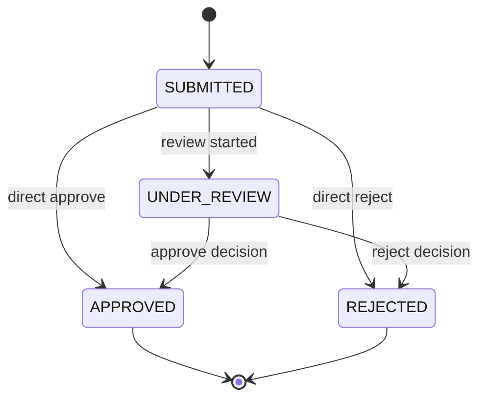

# State Machines: Player Onboarding

## CandidateApplicationLifecycle

### Transition Table

| From         | Event                               | To           | Guard              | Effect                             |
| ------------ | ----------------------------------- | ------------ | ------------------ | ---------------------------------- |
| [new]        | SubmitCandidateApplication          | SUBMITTED    | Rules R1-R7 valid  | Persist application and acceptance |
| SUBMITTED    | StartManualReview                   | UNDER_REVIEW | Application exists | Register review start              |
| SUBMITTED    | ReviewCandidateApplication(APPROVE) | APPROVED     | Review authorized  | Close as approved                  |
| SUBMITTED    | ReviewCandidateApplication(REJECT)  | REJECTED     | Review authorized  | Close as rejected                  |
| UNDER_REVIEW | ReviewCandidateApplication(APPROVE) | APPROVED     | Review authorized  | Close as approved                  |
| UNDER_REVIEW | ReviewCandidateApplication(REJECT)  | REJECTED     | Review authorized  | Close as rejected                  |

### Invariants

| ID  | Invariant                                                  | Formal                                                                                         |
| --- | ---------------------------------------------------------- | ---------------------------------------------------------------------------------------------- |
| I1  | closed application cannot transition back to active states | `status in {APPROVED, REJECTED} -> nextStatus not in {SUBMITTED, UNDER_REVIEW}`                |
| I2  | every submitted application includes rules acceptance      | `status in {SUBMITTED, UNDER_REVIEW, APPROVED, REJECTED} -> ruleAcceptance.acceptedAt != null` |
| I3  | every submitted application includes LGPD consent          | `status in {SUBMITTED, UNDER_REVIEW, APPROVED, REJECTED} -> lgpdConsentAccepted = true`        |
