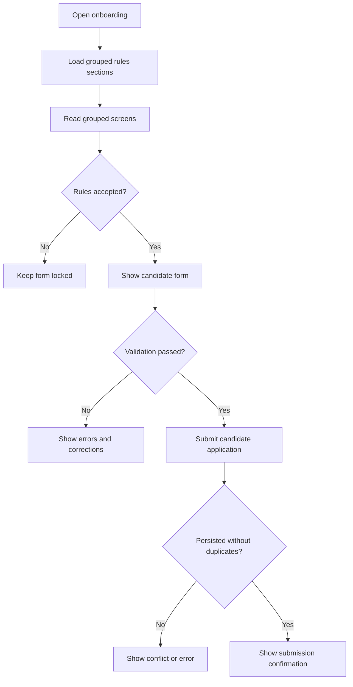
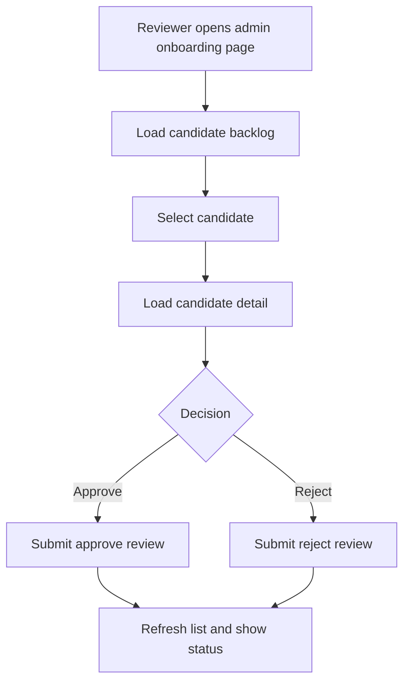

# Workflows: Player Onboarding

## CandidateOnboardingFlow

**Type:** Workflow
**Triggers:** Public access to onboarding
**Orchestrates:** [SubmitCandidateApplication](operations.md#submitcandidateapplication)
**Compensation Strategy:** none
**Idempotency:** conditional: submission is not idempotent, but duplicate checks block repeated contact-based submissions

### Steps

### Step Table

| #   | Step                               | Actor     | Operation                                                              | On Success               | On Failure                      | Compensation |
| --- | ---------------------------------- | --------- | ---------------------------------------------------------------------- | ------------------------ | ------------------------------- | ------------ |
| 1   | Load rules composition             | System    | GET /onboarding/flow (+ optional `regulationVersion` query override)   | Render screens           | Show loading error              | -            |
| 2   | Read and navigate grouped sections | Candidate | -                                                                      | Enable acceptance action | Stay in rules flow              | -            |
| 3   | Register acceptance                | Candidate | -                                                                      | Unlock form              | Keep next step blocked          | -            |
| 4   | Submit form                        | Candidate | [SubmitCandidateApplication](operations.md#submitcandidateapplication) | Show confirmation        | Show validation/conflict errors | -            |

### Invariants

| ID  | Invariant                                               | Formal                                                                                 |
| --- | ------------------------------------------------------- | -------------------------------------------------------------------------------------- |
| I1  | form cannot be submitted without rules acceptance       | `canSubmit = true -> acceptedRegulationVersion != '' and acceptedRegulationAt != null` |
| I2  | persisted applications must always include LGPD consent | `persisted(CandidateApplication) -> lgpdConsentAccepted = true`                        |

---

## RuleScreenGroupingPolicy

**Type:** Policy
**Applies To:** CandidateOnboardingFlow steps 1 and 2
**Trigger Conditions:** Flow composition from active rules version

### Decision Table

| Condition                                         | Selected Behavior                | Notes                         |
| ------------------------------------------------- | -------------------------------- | ----------------------------- |
| Topic fits in one screen without excessive scroll | Keep one section per screen      | Prioritize focused reading    |
| Topic is short and semantically linked to next    | Group two sections in one screen | Avoid over-fragmentation      |
| Device has reduced viewport                       | Split into smaller screens       | Prioritize mobile readability |

### Configuration Parameters

| Parameter                 | Type    | Default | Description                                 |
| ------------------------- | ------- | ------- | ------------------------------------------- |
| maxContentTokensPerScreen | integer | 900     | Approximate threshold to avoid long screens |
| enforceAcceptanceGate     | boolean | true    | Requires acceptance before form unlock      |
| requireProgressIndicator  | boolean | true    | Displays reading progress indicator         |

---

## AdminCandidateReviewFlow

**Type:** Workflow
**Triggers:** Reviewer opens onboarding admin page
**Orchestrates:** `GET /admin/onboarding/candidates`, `GET /admin/onboarding/candidates/{id}`, [ReviewCandidateApplication](operations.md#reviewcandidateapplication)
**Compensation Strategy:** none
**Idempotency:** review decision is write-once for final states

### Steps

### Invariants

| ID  | Invariant                                               | Formal                                                                    |
| --- | ------------------------------------------------------- | ------------------------------------------------------------------------- |
| I1  | reviewer endpoints require split onboarding review permissions | `AuthorizeRequest(requiredPermission in {'player-onboarding.review.listCandidates','player-onboarding.review.getCandidateDetail','player-onboarding.review.evaluateApplication'}) = ALLOW` |
| I2  | rejected entries must carry deterministic retention     | `status = REJECTED -> retentionUntil = reviewedAt + 365d`                 |
