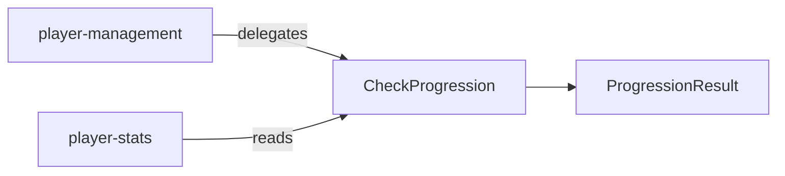

# Player Progression

## What This Module Owns

Player Progression evaluates whether a player qualifies for limit promotion based on recent volume and winrate. It computes deterministic metrics over either 15-day (bi-weekly) or 30-day (monthly) windows and returns eligibility with a human-readable reason. This is a read-only assessment consumed by player-management's progression check endpoint.

## Module Map

## Capabilities

### Check Progression

Evaluate limit promotion readiness for a player based on stats-driven criteria.

| Aspect    | Concept                                                 | Summary                                                   |
| --------- | ------------------------------------------------------- | --------------------------------------------------------- |
| Operation | [CheckProgression](operations.md#checkprogression)      | Evaluates promotion criteria against player stats window  |
| Query     | [GetProgressionStatus](queries.md#getprogressionstatus) | Read model for current progression evaluation             |
| Mapping   | [ProgressionPeriodQueryToDays](mappings.md#progressionperiodquerytodays) | Maps external period query to deterministic day window |
| State     | [ProgressionEvaluationLifecycle](states.md#progressionevaluationlifecycle) | Captures request-to-evaluation lifecycle state |
| Event     | [ProgressionChecked](events.md#progressionchecked)      | Emits evaluated progression result for consumers          |
| Domain    | [ProgressionResult](domain.md#progressionresult)        | Value object with eligibility flag and criteria breakdown |
| Domain    | [ProgressionCriteria](domain.md#progressioncriteria)    | Configurable thresholds for limit promotion               |

## Domain Concepts

| Concept                                              | Type         | Key Constraints                                                            |
| ---------------------------------------------------- | ------------ | -------------------------------------------------------------------------- |
| [ProgressionResult](domain.md#progressionresult)     | Value Object | Contains `eligibleForPromotion`, `reason`, `avgHands`, `winrate`, `period` |
| [ProgressionCriteria](domain.md#progressioncriteria) | Value Object | `minHands = 1000/day avg`, `minWinrate = 5 bb/100`                         |

## Concept Registry

| Concept                                                 | ID                                      | Type         |
| ------------------------------------------------------- | --------------------------------------- | ------------ |
| [ProgressionResult](domain.md#progressionresult)        | player-progression.ProgressionResult    | Value Object |
| [ProgressionCriteria](domain.md#progressioncriteria)    | player-progression.ProgressionCriteria  | Value Object |
| [CheckProgression](operations.md#checkprogression)      | player-progression.CheckProgression     | Operation    |
| [GetProgressionStatus](queries.md#getprogressionstatus) | player-progression.GetProgressionStatus | Query        |
| [ProgressionPeriodQueryToDays](mappings.md#progressionperiodquerytodays) | player-progression.ProgressionPeriodQueryToDays | Mapping |
| [ProgressionResultToStatusProjection](mappings.md#progressionresulttostatusprojection) | player-progression.ProgressionResultToStatusProjection | Mapping |
| [ProgressionEvaluationLifecycle](states.md#progressionevaluationlifecycle) | player-progression.ProgressionEvaluationLifecycle | State Machine |
| [PromotionEligibilityState](states.md#promotioneligibilitystate) | player-progression.PromotionEligibilityState | State Machine |
| [ProgressionChecked](events.md#progressionchecked) | player-progression.ProgressionChecked | Event |
| [ProgressionCheckWorkflow](workflows.md#progressioncheckworkflow) | player-progression.ProgressionCheckWorkflow | Workflow |

## Concepts

| Concept                                                 | ID                                      | Type          | Description                                                 |
| ------------------------------------------------------- | --------------------------------------- | ------------- | ----------------------------------------------------------- |
| [CheckProgression](operations.md#checkprogression)      | player-progression.CheckProgression     | Operation     | Evaluates promotion readiness from deterministic criteria   |
| [GetProgressionStatus](queries.md#getprogressionstatus) | player-progression.GetProgressionStatus | Query         | Returns progression status projection for API consumers     |
| [ProgressionResult](domain.md#progressionresult)        | player-progression.ProgressionResult    | Value Object  | Result payload with eligibility and reason fields           |
| [ProgressionCriteria](domain.md#progressioncriteria)    | player-progression.ProgressionCriteria  | Value Object  | Threshold configuration for promotion eligibility decisions |
| [ProgressionChecked](events.md#progressionchecked)      | player-progression.ProgressionChecked   | Event         | Event emitted after progression evaluation                  |
| [ProgressionEvaluationLifecycle](states.md#progressionevaluationlifecycle) | player-progression.ProgressionEvaluationLifecycle | State Machine | Evaluation lifecycle state transitions                      |
| [ProgressionCheckWorkflow](workflows.md#progressioncheckworkflow) | player-progression.ProgressionCheckWorkflow | Workflow      | Orchestrates progression evaluation end-to-end              |
| [ProgressionPeriodQueryToDays](mappings.md#progressionperiodquerytodays) | player-progression.ProgressionPeriodQueryToDays | Mapping       | Maps period selector into deterministic day window          |

## Feature Concept Graph

| From                                                    | Edge         | To                                              | Evidence                                             | Notes                                      |
| ------------------------------------------------------- | ------------ | ----------------------------------------------- | ---------------------------------------------------- | ------------------------------------------ |
| player-progression.ProgressionCheckWorkflow             | orchestrates | player-progression.CheckProgression             | workflows.md#progressioncheckworkflow                | Workflow coordinates progression check     |
| player-progression.CheckProgression                     | produces     | player-progression.ProgressionChecked           | operations.md#checkprogression                       | Operation emits evaluation event           |
| player-progression.ProgressionChecked                   | transitions  | player-progression.ProgressionEvaluationLifecycle | states.md#progressionevaluationlifecycle             | Event drives lifecycle transition          |
| player-progression.GetProgressionStatus                | queries      | player-progression.ProgressionResult            | queries.md#getprogressionstatus                      | Query returns domain result projection     |
| player-progression.ProgressionPeriodQueryToDays        | maps         | player-progression.ProgressionResult            | mappings.md#progressionperiodquerytodays             | Mapping normalizes period input semantics  |

## Aspect Docs

| Aspect | Contains | Key Concepts |
| ------ | -------- | ------------ |
| [Domain](domain.md) | Value objects and constraints | ProgressionResult, ProgressionCriteria |
| [Operations](operations.md) | Eligibility rule execution | CheckProgression |
| [Queries](queries.md) | Read projection | GetProgressionStatus |
| [Mappings](mappings.md) | Input/output transformation | ProgressionPeriodQueryToDays, ProgressionResultToStatusProjection |
| [States](states.md) | Evaluation lifecycle states | ProgressionEvaluationLifecycle, PromotionEligibilityState |
| [Events](events.md) | Evaluated status event | ProgressionChecked |
| [Workflows](workflows.md) | End-to-end orchestration | ProgressionCheckWorkflow |
| [Interfaces](interfaces.md) | REST contract | PlayerProgressionAPI |

## Cross-Feature Dependencies

| Depends On        | Relationship | Why                                            |
| ----------------- | ------------ | ---------------------------------------------- |
| player-management | queries      | Resolve player identity, current limit         |
| player-stats      | queries      | Read stats window for promotion criteria check |

## Produces For

| Consumer          | Via       | What                             |
| ----------------- | --------- | -------------------------------- |
| player-management | Operation | Progression readiness evaluation |
| web dashboard     | Interface | Progression status display       |

## Stories

See [STORIES.md](STORIES.md) for capability-scoped user stories with classic + BDD format, acceptance checks, and Story Coverage Matrix.

## User Stories

See [STORIES.md](STORIES.md) for classic and BDD story definitions.

## Story Coverage Matrix

See [Story Coverage Matrix](STORIES.md#story-coverage-matrix) for concept and capability coverage.

## Pilot Decisions

Pilot policy and verification decisions are recorded in [PILOT-DECISIONS.md](PILOT-DECISIONS.md).

## References

- [Test specification](TEST-SPEC.md)
