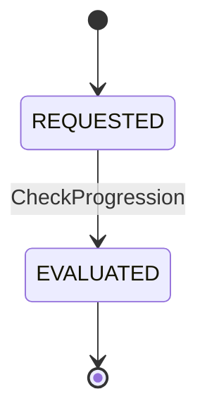
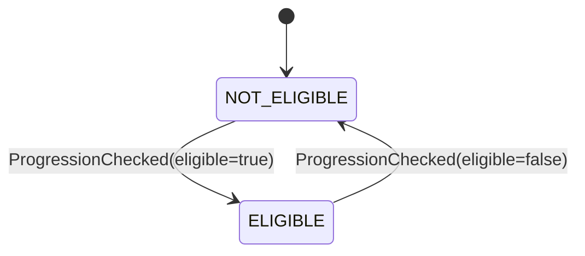

# States: Player Progression

## ProgressionEvaluationLifecycle

### Transition Table

| From | Event | To | Guard | Effect |
| ---- | ----- | -- | ----- | ------ |
| [new] | CheckProgressionRequested | REQUESTED | Valid player id and allowed period | Evaluation pipeline starts |
| REQUESTED | ProgressionChecked | EVALUATED | Stats window and policy evaluation completed | Deterministic progression status returned |

## PromotionEligibilityState

### Invariants

| ID | Invariant | Formal |
| --- | --------- | ------ |
| I1 | Eligibility is derived only from evaluated period metrics | `eligibleForPromotion = f(avgHands, winrate, periodDays)` |
| I2 | Returned period label matches periodDays input | `(periodDays = 15 -> period = BI_WEEKLY) and (periodDays = 30 -> period = MONTHLY)` |
