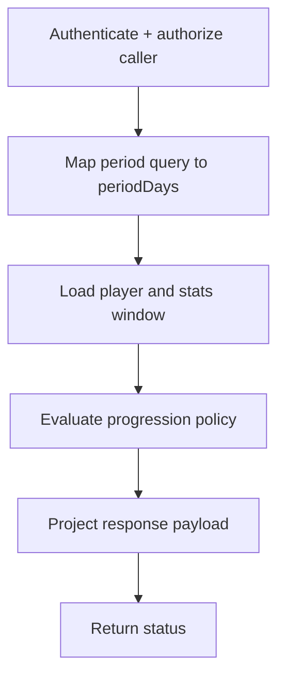

# Workflows: Player Progression

## ProgressionCheckWorkflow

**Type:** Workflow
**Triggers:** `GET /players/:id/progression`
**Orchestrates:** [CheckProgression](operations.md#checkprogression), [GetProgressionStatus](queries.md#getprogressionstatus)
**Compensation Strategy:** none
**Idempotency:** yes (same inputs produce same output for unchanged stats)

### Steps

### Step Table

| # | Step | Actor | Operation | On Success | On Failure | Compensation |
| --- | ---- | ----- | --------- | ---------- | ---------- | ------------ |
| 1 | Auth guard | API | CheckProgression | Step 2 | 401/403 | - |
| 2 | Period mapping | API | [ProgressionPeriodQueryToDays](mappings.md#progressionperiodquerytodays) | Step 3 | 400 | - |
| 3 | Domain inputs load | Use-case | CheckProgression | Step 4 | 404/500 | - |
| 4 | Policy evaluation | Domain | CheckProgression | Step 5 | 500 | - |
| 5 | Response projection | API | [ProgressionResultToStatusProjection](mappings.md#progressionresulttostatusprojection) | done | 500 | - |

### Invariants

| ID | Invariant | Formal |
| --- | --------- | ------ |
| I1 | Invalid period never reaches domain policy | `period not in {BI_WEEKLY, MONTHLY} -> request rejected` |
| I2 | No persistence side-effects occur in progression checks | `checkProgression => writes = 0` |
