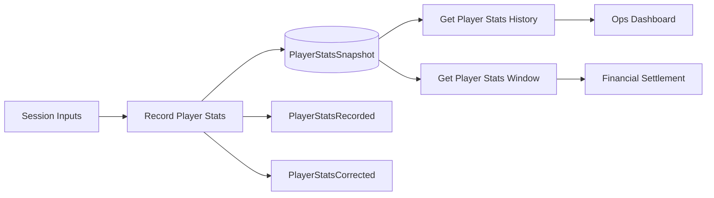

# Player Stats Tracking

## What This Module Owns

Player Stats Tracking owns the authoritative ingestion and retrieval of player performance snapshots per date window. It defines validation, deduplication, correction, derived metric computation (winrate, avgHandsPerDay), and aggregate read contracts used by operations dashboards, progression eligibility, and financial consumers.

## Module Map

## Capabilities

### Record Player Stats

Persist one validated stats snapshot for a player and date, with deterministic update semantics.

| Aspect | Concept | Summary |
| ------ | ------- | ------- |
| Operation | [RecordPlayerStats](operations.md#recordplayerstats) | Validates input, ensures player exists, upserts one record per player/date |
| Interface | [POST /player-stats](interfaces.md#post-player-stats) | Write contract for ingestion and correction |
| State/Event | [PlayerStatsRecordLifecycle](states.md#playerstatsrecordlifecycle) | Draftless lifecycle: Recorded -> Corrected |
| Event | [PlayerStatsRecorded](events.md#playerstatsrecorded) | Emitted on first record for player/date |
| Event | [PlayerStatsCorrected](events.md#playerstatscorrected) | Emitted when same player/date is re-submitted with changes |

### Get Player Stats History

Read chronological stats snapshots for one player, filtered by date range and paginated.

| Aspect | Concept | Summary |
| ------ | ------- | ------- |
| Query | [GetPlayerStatsHistory](queries.md#getplayerstatshistory) | Returns newest-first records for one player |
| Interface | [GET /player-stats/:playerId/history](interfaces.md#get-player-statsplayeridhistory) | Read endpoint with cursor and limit |
| Mapping | [PlayerStatsEntityToHistoryItem](mappings.md#playerstatsentitytohistoryitem) | Domain entity to API list item |

### Get Player Stats Window

Read aggregate metrics for a player and window used by overview, progression, and settlement consumers. Optionally enriches with derived BB/100 winrate when `currentLimit` is provided.

| Aspect | Concept | Summary |
| ------ | ------- | ------- |
| Query | [GetPlayerStatsWindow](queries.md#getplayerstatswindow) | Aggregates hands, profit, rakeback, rake, session time, and derived metrics |
| Interface | [GET /player-stats/:playerId/window](interfaces.md#get-player-statsplayeridwindow) | Date-window aggregate endpoint |
| Mapping | [PlayerStatsWindowToProjection](mappings.md#playerstatswindowtoprojection) | Aggregate model to response projection |

## Domain Concepts

| Concept | Type | Key Constraints |
| ------- | ---- | --------------- |
| [PlayerStatsSnapshot](domain.md#playerstatssnapshot) | Entity | Unique by `playerId + statDate`; non-negative hands; tracks hands, profit, rakeback, rake, closingBankroll, sessionDuration |
| [StatsSourceType](domain.md#statssourcetype) | Enum / Type | `MANUAL`, `IMPORT`, `API` |
| [StatsRecordStatus](domain.md#statsrecordstatus) | Enum / Type | `RECORDED`, `CORRECTED` |
| [PlayerStatsWindow](domain.md#playerstatswindow) | Value Object | Window aggregate with derived avgHandsPerDay and winrateBbPer100 |

## Concept Registry

| Concept | ID | Type |
| ------- | -- | ---- |
| [PlayerStatsSnapshot](domain.md#playerstatssnapshot) | player-stats.PlayerStatsSnapshot | Entity |
| [PlayerStatsWindow](domain.md#playerstatswindow) | player-stats.PlayerStatsWindow | Value Object |
| [StatsSourceType](domain.md#statssourcetype) | player-stats.StatsSourceType | Enum / Type |
| [StatsRecordStatus](domain.md#statsrecordstatus) | player-stats.StatsRecordStatus | Enum / Type |
| [RecordPlayerStats](operations.md#recordplayerstats) | player-stats.RecordPlayerStats | Operation |
| [GetPlayerStatsHistory](queries.md#getplayerstatshistory) | player-stats.GetPlayerStatsHistory | Query |
| [GetPlayerStatsWindow](queries.md#getplayerstatswindow) | player-stats.GetPlayerStatsWindow | Query |
| [PlayerStatsAPI](interfaces.md#external-playerstatsapi-rest) | player-stats.PlayerStatsAPI | Interface |
| [PlayerStatsRecorded](events.md#playerstatsrecorded) | player-stats.PlayerStatsRecorded | Event |
| [PlayerStatsCorrected](events.md#playerstatscorrected) | player-stats.PlayerStatsCorrected | Event |
| [PlayerStatsRecordLifecycle](states.md#playerstatsrecordlifecycle) | player-stats.PlayerStatsRecordLifecycle | State Machine |
| [RecordStatsWorkflow](workflows.md#recordstatsworkflow) | player-stats.RecordStatsWorkflow | Workflow |
| [PlayerStatsEntityToHistoryItem](mappings.md#playerstatsentitytohistoryitem) | player-stats.PlayerStatsEntityToHistoryItem | Mapping |
| [PlayerStatsWindowToProjection](mappings.md#playerstatswindowtoprojection) | player-stats.PlayerStatsWindowToProjection | Mapping |

## Concepts

| Concept | ID | Type | Description |
| ------- | --- | ---- | ----------- |
| [PlayerStatsAPI](interfaces.md#external-playerstatsapi-rest) | player-stats.PlayerStatsAPI | Interface | External API for stats ingestion and read endpoints |
| [RecordPlayerStats](operations.md#recordplayerstats) | player-stats.RecordPlayerStats | Operation | Validates and upserts daily stats snapshot |
| [GetPlayerStatsHistory](queries.md#getplayerstatshistory) | player-stats.GetPlayerStatsHistory | Query | Returns paginated history for one player |
| [GetPlayerStatsWindow](queries.md#getplayerstatswindow) | player-stats.GetPlayerStatsWindow | Query | Returns aggregate metrics for a date window |
| [PlayerStatsSnapshot](domain.md#playerstatssnapshot) | player-stats.PlayerStatsSnapshot | Entity | Authoritative daily stats snapshot per player/date |
| [PlayerStatsRecorded](events.md#playerstatsrecorded) | player-stats.PlayerStatsRecorded | Event | Emitted on first write for player/date |
| [PlayerStatsRecordLifecycle](states.md#playerstatsrecordlifecycle) | player-stats.PlayerStatsRecordLifecycle | State Machine | Lifecycle for recorded versus corrected snapshots |
| [RecordStatsWorkflow](workflows.md#recordstatsworkflow) | player-stats.RecordStatsWorkflow | Workflow | Orchestrates validation and persistence path |

## Feature Concept Graph

| From | Edge | To | Evidence | Notes |
| ---- | ---- | --- | -------- | ----- |
| player-stats.PlayerStatsAPI | exposes | player-stats.RecordPlayerStats | interfaces.md#external-playerstatsapi-rest | API exposes write endpoint |
| player-stats.PlayerStatsAPI | exposes | player-stats.GetPlayerStatsHistory | interfaces.md#external-playerstatsapi-rest | API exposes history query endpoint |
| player-stats.PlayerStatsAPI | exposes | player-stats.GetPlayerStatsWindow | interfaces.md#external-playerstatsapi-rest | API exposes aggregate query endpoint |
| player-stats.RecordStatsWorkflow | orchestrates | player-stats.RecordPlayerStats | workflows.md#recordstatsworkflow | Workflow coordinates ingestion flow |
| player-stats.RecordPlayerStats | produces | player-stats.PlayerStatsRecorded | operations.md#recordplayerstats | Operation emits recorded event |
| player-stats.PlayerStatsRecorded | transitions | player-stats.PlayerStatsRecordLifecycle | states.md#playerstatsrecordlifecycle | Event advances lifecycle state |
| player-stats.GetPlayerStatsWindow | queries | player-stats.PlayerStatsSnapshot | queries.md#getplayerstatswindow | Query aggregates from snapshots |

## Aspect Docs

| Aspect | Contains | Key Concepts |
| ------ | -------- | ------------ |
| [Domain](domain.md) | Entities, value objects, enums | PlayerStatsSnapshot, PlayerStatsWindow |
| [Operations](operations.md) | Mutation rules and calculations | RecordPlayerStats |
| [Interfaces](interfaces.md) | REST contracts | PlayerStatsAPI |
| [Queries](queries.md) | History and aggregate reads | GetPlayerStatsHistory, GetPlayerStatsWindow |
| [Mappings](mappings.md) | Entity to API transformations | PlayerStatsEntityToHistoryItem, PlayerStatsWindowToProjection |
| [Workflows](workflows.md) | Ingestion orchestration | RecordStatsWorkflow |
| [States](states.md) | Record lifecycle transitions | PlayerStatsRecordLifecycle |
| [Events](events.md) | Producer and consumer contracts | PlayerStatsRecorded, PlayerStatsCorrected |

## Cross-Feature Dependencies

| Depends On                                            | Relationship   | Why |
| ----------------------------------------------------- | -------------- | --- |
| [player-management](../player-management/SPEC.md)     | queries        | Validate player existence and resolve optional limit context |
| [auth-access-control](../auth-access-control/SPEC.md) | enforces-cross | Enforce read/write permission gates for stats endpoints |

## Produces For

| Consumer | Consumes Capability | Via | What |
| -------- | ------------------- | --- | ---- |
| player-management | Get Player Stats Window | Query | Hands/profit window for overview projection |
| player-progression | Get Player Stats Window | Query | Avg hands/winrate for limit promotion eligibility |
| financial-settlement | Get Player Stats Window | Query | Profit/rakeback window inputs for settlement generation |
| operations dashboard | Get Player Stats History | Interface | Timeline of tracked daily performance |

## Stories

See [User Stories](STORIES.md) for capability-scoped scenarios and BDD acceptance coverage.

## User Stories

See [STORIES.md](STORIES.md) for classic and BDD story definitions.

## Story Coverage Matrix

See [Story Coverage Matrix](STORIES.md#story-coverage-matrix) for concept and capability coverage.

## Pilot Decisions

Pilot policy and verification decisions are recorded in [PILOT-DECISIONS.md](PILOT-DECISIONS.md).

## References

- [Implementation tasks](tasks.en.md)
- [Architecture decisions](decisions.en.md)
- [Test specification](TEST-SPEC.md)
