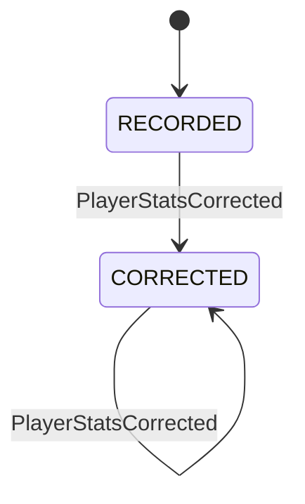

# States: Player Stats Tracking

> **Capabilities using this aspect:** [Record Player Stats](SPEC.md#record-player-stats)

## PlayerStatsRecordLifecycle

### Transition Table

| From | Event | To | Guard | Effect |
| ---- | ----- | -- | ----- | ------ |
| [new] | PlayerStatsRecorded | RECORDED | Valid payload and player exists | Snapshot persisted |
| RECORDED | PlayerStatsCorrected | CORRECTED | At least one value changed | Snapshot updated |
| CORRECTED | PlayerStatsCorrected | CORRECTED | At least one value changed | Snapshot updated |

### Invariants

| ID | Invariant | Formal |
|----|-----------|--------|
| I1 | One snapshot per day identity | `unique(playerId, statDate)` |
| I2 | Hands are always non-negative | `hands >= 0` |
