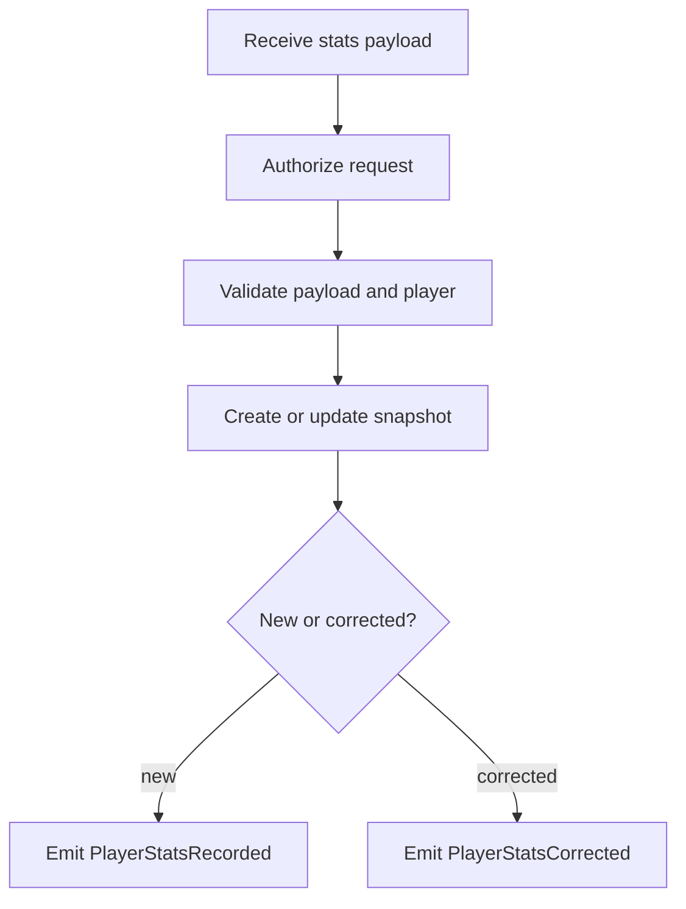

# Workflows: Player Stats Tracking

> **Capabilities using this aspect:** [Record Player Stats](SPEC.md#record-player-stats)

## RecordStatsWorkflow

**Type:** Workflow
**Triggers:** `POST /player-stats`
**Orchestrates:** [RecordPlayerStats](operations.md#recordplayerstats)
**Compensation Strategy:** none
**Idempotency:** conditional: same payload for same `playerId + statDate` produces no semantic drift

### Steps

### Step Table

| # | Step | Actor | Operation | On Success | On Failure | Compensation |
|---|------|-------|-----------|------------|------------|--------------|
| 1 | Authorize | API layer | [RecordPlayerStats](operations.md#recordplayerstats) | Validate payload | Return 401/403 | - |
| 2 | Validate | Domain layer | [RecordPlayerStats](operations.md#recordplayerstats) | Persist snapshot | Return 400/404 | - |
| 3 | Persist | Repository | [RecordPlayerStats](operations.md#recordplayerstats) | Emit domain event | Return 500 | - |

### Invariants

| ID | Invariant | Formal |
| -- | --------- | ------ |
| I1 | Unique record identity per day | `count(playerId, statDate) = 1` |
| I2 | Window consumers read deterministic aggregates | `aggregate(window) == sum(matched snapshots)` |
