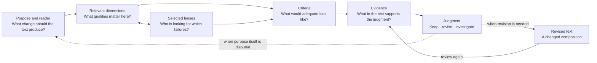

# Evaluating Text as Composition

> This essay proposes a practical way to think about textual quality. It begins from writing and
> review practice in this repository; it does not claim that the proposed categories are complete,
> independent, or empirically validated. The musical vocabulary introduced near the end is a
> source of questions for later research, not a formal correspondence between music and prose.

## 1. Good sentences can still make a bad text

A document can contain correct facts, clear sentences, polished headings, and useful diagrams and
still fail. The reader reaches the end without being able to say what the document was trying to
change in their understanding, why one section followed another, or which conclusions can be
trusted.

Nothing needs to be obviously broken at the local level. Each paragraph may be defensible on its
own. The failure appears in the relations among the parts: an idea arrives before its need is
visible; an example does not change the argument; a conclusion is stronger than its preparation;
a visual repeats the prose without revealing anything new. The pieces are individually acceptable
but do not form a successful whole.

This suggests a broader object for evaluation. We should inspect sentences and paragraphs, but we
should also inspect their composition.

## 2. What composition means in a text

For purpose-driven prose read substantially in sequence, composition is the way a text organizes
material across the reader's traversal to enable an intended effect. The material includes words,
concepts, claims, examples, evidence, headings, tables, and diagrams. The composition includes
which of these appear, the relations among them, their order, the attention they demand, and the
function each performs in the whole.

The change may be modest. A reader may learn a distinction, recognize a problem, understand how a
system works, judge a proposal, or become able to make a decision. What matters is that the
document aims to change what the reader understands, judges, or can do, rather than merely naming
a topic in the world.

This gives us a practical test for every part:

> What necessary contribution does this part make to the reader's movement or use of the text—by
> establishing, reinforcing, retrieving, pacing, qualifying, or connecting understanding?

A passage may provide orientation, create a question, introduce a distinction, support a claim,
show a consequence, qualify a conclusion, or prepare the next step. Different functions are
possible. A part becomes suspect when its contribution to the reader's movement cannot be named.

## 3. The text exists at several scales

Evaluation often begins at one scale: word choice, sentence clarity, paragraph unity, or document
structure. Composition requires moving among them.

```text
local elements        units and relations        whole and use
words, sentences  ↔  paragraphs, sections  ↔  document  ↔  reader
examples, evidence    headings, recurring ideas     purpose
tables, diagrams

part contributes upward  →
                         ←  whole constrains downward
```

The arrow does not mean that larger quality is the sum of smaller quality. A precise sentence can
support the wrong paragraph. A coherent paragraph can interrupt the argument. A strong section can
receive too much emphasis relative to the document's purpose. Local success contributes to the
whole only through the relations that connect it to other parts.

The opposite direction also matters. The purpose of the document constrains what a section must
do; the section constrains what its paragraphs must establish; the paragraph constrains which
sentences belong. We therefore evaluate upward—asking what each part contributes—and
downward—asking what the whole requires from each part. Neither direction substitutes for the
other.

## 4. Composition is more than structure

Structure names parts and their arrangement. Composition also includes dependency, emphasis,
movement, and return.

In cumulative explanatory or argumentative prose, a sequence becomes meaningful when later parts
use what earlier parts made available. Concepts and abstractions should appear when that ordering
helps the intended reader understand them, and transitions should expose the relevant dependency.
Modular and reference texts may instead compose through clear routes, comparisons, and locally
sufficient context; their parts need not form one irreversible sequence.

Emphasis distributes attention. Space, repetition, position, typography, and visual prominence
tell the reader what matters. When emphasis and importance diverge, the text teaches the wrong
hierarchy even if every statement remains true.

Movement is the changing state of the reader. Dense explanation, concrete example, contrast,
qualification, and synthesis create different kinds of movement. An ending succeeds when it
returns the reader to the subject with a judgment made possible by the journey. It does not need to
repeat everything that came before.

## 5. Why “good writing” is too broad to evaluate

Calling a text good or bad compresses several different judgments into one word. A document may be
logically careful but unpleasant to read. It may be elegant but unsupported. It may be accurate
and still useless to its intended reader. Improving one quality can damage another: additional
qualification may increase fidelity while reducing movement; simplification may improve access
while erasing a necessary distinction.

A useful evaluation must therefore separate the quality being judged, the standpoint used to
inspect it, the standard applied, and the evidence supporting the judgment. Four elements help:

| Category | What it is | Question it answers | Failure when confused |
|---|---|---|---|
| **Dimension** | A quality of the text or its effect | What aspect of quality are we judging? | “Good” remains an undifferentiated impression. |
| **Lens** | A deliberate standpoint used to inspect the text | From whose concern are we looking? | A reviewer's perspective is mistaken for a property of the text. |
| **Criterion** | A context-specific standard for adequacy | What would count as good enough here? | A general value becomes either vague advice or a universal rule. |
| **Evidence** | An observable passage, omission, transition, visual, or reader response | What supports the judgment? | A score or opinion is mistaken for a demonstrated problem. |

These categories are related, but they are not interchangeable. A first-time-reader lens can
expose problems in precision, narrative, concepts, and visual design. Narrative quality can be
examined by a first-time reader, a logician, or a decision-maker. The relevant criteria change
with the document, audience, and purpose.

Consider a system overview that opens with five unexplained technical terms. **Reader fit** is the
dimension at risk. A **first-time-reader** lens exposes it. A useful **criterion** is that the
purpose should be understandable before internal terminology appears. The unexplained opening is
the **evidence**. The judgment is not merely “too technical”: move the practical problem before the
terms, then introduce each term when it becomes necessary.

## 6. Dimensions of textual quality

The following dimensions form a working inventory. They are grouped to reduce cognitive load, not
because the groups have been proven exhaustive or independent.

The categories interact. A text may be precise but badly ordered, or pleasant to read but weakly
supported. The inventory separates questions that are useful to inspect independently; it does not
claim that the underlying qualities are statistically independent or that their results can be
added into one score.

### 6.1 Truth and exactness

- **Fidelity:** claims remain within their evidence and current status.
- **Conceptual quality:** central ideas are distinct, stable, and useful.
- **Logical quality:** conclusions follow without hidden steps, circularity, or false necessity.
- **Semantic precision:** wording controls ambiguity, scope, reference, and modal strength.

These dimensions ask whether the reader is being given something they are entitled to rely on. A
text can fail here by making a true statement carry a broader implication than its evidence
supports, or by using one word for several materially different ideas.

### 6.2 Movement and coherence

- **Narrative architecture:** in cumulative explanatory or argumentative prose, each part prepares
  or creates a need for the next; modular texts instead provide clear navigation and enough local
  context for each route.
- **Paragraph and section function:** local units perform recognizable work in the whole.
- **Rhythm and pacing:** difficulty, relief, emphasis, and density are distributed deliberately.
- **Closure:** the ending completes the intended movement without manufacturing certainty.

These dimensions ask whether the document creates the movement its form requires. In cumulative
prose, rearrangement should have consequences. In reference or modular writing, the important
relations may instead be visible routes, comparisons, and dependencies among sections.

### 6.3 Reader and use

- **Reader fit:** the document assumes the right prior knowledge and respects the reader's
  intelligence.
- **Practical value:** the resulting understanding can support a judgment, discussion, or action.
- **Reading experience:** the text sustains attention without using fluency to conceal weak logic.

These dimensions ask whether the composition works for an actual person. Accessibility does not
mean removing every difficult idea. It means building the steps required to understand it.

### 6.4 Economy and form

- **Editorial economy:** every demand on attention returns understanding, precision, trust, or
  useful emphasis.
- **Information design:** headings, spacing, lists, tables, and diagrams make intellectual
  relationships visible.

These dimensions ask whether form reduces the cost of comprehension. Minimalism is not shortness;
it is the absence of attention spent without return.

## 7. Lenses direct the review

A dimension belongs to the evaluation model. A lens is a role we choose because it is likely to
notice a particular kind of failure.

| Lens | Primary concern | Typical question |
|---|---|---|
| **First-time reader** | Unprepared concepts and missing steps | Where did the text require knowledge it never supplied? |
| **Evidence skeptic** | Claims stronger than their support | Which statement would need more evidence or a narrower scope? |
| **Logician** | Invalid dependency or inference | Which conclusion does not follow from what preceded it? |
| **Decision-maker** | Relevance and practical consequence | What can I understand or decide after reading this? |
| **Information designer** | Visible hierarchy and relationships | Does the form expose the argument or compete with it? |
| **Editor** | Economy, movement, and reading experience | What can be removed, moved, or compressed without loss? |

No lens owns one dimension, and no dimension should be trusted because one lens found no problem.
Different lenses create structured disagreement. Their value is not that each supplies an
independent truth, but that each makes a different failure easier to see.

## 8. Criteria make a review actionable

Dimensions without criteria remain aspirations. “Be clear” does not tell an editor what to inspect.
Criteria translate a relevant dimension into conditions that can be checked for one document.

Suppose the document must explain an unfamiliar system to an executive reader. For the dimension
of reader fit, useful criteria might include:

- the purpose can be stated after the opening without knowing internal terminology;
- every technical term is introduced after the practical need for it appears;
- the reader can distinguish what exists today from what is proposed;
- the ending states the intended consequence and the important limits.

These are not universal laws of prose. A dictionary, novel, legal contract, and system overview
have different purposes and therefore need different criteria. Criteria should be specific enough
to guide judgment, but not so mechanical that satisfying their wording defeats their purpose.

Evidence completes the evaluation. The reviewer should be able to point to the passage, transition,
visual, omission, or reader response that supports the judgment. A score without this evidence
hides disagreement rather than resolving it.

Some compositional qualities are temporal: expectation, recurrence, acceleration, pause, tension,
and return. Ordinary editorial vocabulary describes them unevenly. This gap creates a reason to
ask, later, whether music offers useful concepts for seeing them more precisely.

## 9. How the evaluation composes

Purpose gives the evaluation direction. Dimensions separate the qualities at stake. Lenses create
deliberately different inspections. Criteria state what adequacy would look like in this case.
Evidence supports a judgment, and the judgment produces a revision or preserves an open question.



The diagram is a working model, not a universal evaluation algorithm. In practice, a lens may
reveal a dimension that was omitted, evidence may force a criterion to be revised, and the review
may expose a disagreement about the document's purpose itself.

## 10. A lightweight review in practice

The model should not turn writing into form completion. Use only the distinctions needed for the
document at hand:

1. State the reader's starting point and the change the document should produce.
2. Select the dimensions whose failure would materially damage that purpose.
3. Choose lenses likely to expose different failures.
4. Define a small number of criteria for this reader and document.
5. Review the local parts and the complete movement in both directions.
6. Cite the text that supports each requested change.
7. Preserve genuine uncertainty instead of forcing one aggregate score.

A simple deletion or movement test is often revealing. Remove or move a passage and ask what
breaks. If a premise disappears, a distinction loses support, or the next section arrives without
motivation, the passage has a compositional function. If nothing changes, it may be redundant or
misplaced.

## 11. Exploratory coda: what music may help us notice

Music gives the word *composition* a richer field of associations. A note may be correct and still
be wrong for a phrase. A phrase can make sense locally while weakening the larger movement. Timing,
repetition, contrast, tension, release, silence, recurrence, and variation shape what a listener
experiences over time. These observations resemble problems we encounter in prose.

The analogy may help generate practical questions:

| Musical idea | Question for a text |
|---|---|
| **Rhythm** | How are density, pause, speed, and emphasis distributed? |
| **Motif** | Which idea returns, and does each return add or change meaning? |
| **Tension and release** | Which question or contradiction keeps the reader moving, and where is it resolved? |
| **Harmony and dissonance** | Which concepts support one another, and which contradictions are deliberate or accidental? |
| **Dynamics** | Where does the text increase or reduce force, detail, or urgency? |
| **Orchestration** | Which medium—prose, example, table, diagram—should carry each part? |
| **Silence** | What can remain unstated because the reader is prepared to supply it? |
| **Recapitulation** | Does the ending return to earlier material with changed significance? |

These are analogies, not mappings. Prose and music do not necessarily share the same formal
structure, and a musical term is useful only if it reveals a textual relation more clearly than
ordinary language. If the reader must learn music theory before understanding the writing problem,
the analogy has increased the very cost it was meant to reduce.

The deeper possibility deserves research. Music may provide more than metaphors: it may offer
developed concepts for temporal expectation, hierarchy, repetition, variation, voice, and large-scale
form. But we should investigate that possibility rather than assuming it.

## 12. Open questions

- Are the proposed dimensions sufficient, or do important qualities remain hidden inside them?
- Which dimensions are genuinely distinct, and which are different views of the same property?
- How should tensions among fidelity, accessibility, economy, and reading pleasure be resolved?
- Can criteria become observable without reducing judgment to box-checking?
- How consistently can different reviewers apply the same dimensions and criteria?
- When do multiple lenses improve judgment, and when do they only multiply opinions?
- Can any overall evaluation be useful without concealing important disagreement?
- How should reader response be tested rather than imagined?
- Which musical concepts illuminate textual composition, and which merely rename familiar advice?
- Do different forms of writing require different compositional models?
- How should the model change for linear reading, scanning, lookup, rereading, and branching
  navigation?
- Does this framework measurably improve documents or editorial decisions?

## 13. Evidence boundary

This essay's practical composition patterns derive from existing repository essays and editorial
practice. The distinction among dimensions, lenses, criteria, and evidence is new synthesis. The
dimension inventory, the evaluation flow, and the musical questions remain proposals to test.

Essays in the sibling `business-philosopher` repository were consulted for compositional
precedents, particularly the movement from concrete situation to abstraction and from abstraction
to practical consequence. Copies found in `ZefraHub` share the same imported lineage and therefore
do not provide independent confirmation. No sibling source is treated as authority for the model
proposed here or as a durable dependency of this vault document.

## 14. What this proposal changes

Evaluating text as composition changes the unit of attention. We still care whether a sentence is
clear, but we also ask what it makes possible. We still care whether a paragraph is coherent, but
we also ask why it exists here. We still care whether a diagram is attractive, but we ask which
relationship it makes visible.

This approach also changes review. Instead of requesting that a text become vaguely “better,” we
can identify the dimension at risk, choose a lens capable of exposing it, state a criterion suited
to the document, and cite the evidence behind the judgment. Disagreement becomes easier to locate:
the reviewers may disagree about the purpose, the dimension's importance, the criterion, or what
the evidence shows.

The central proposal is simple:

> A purpose-driven text is not only a collection of parts. It is an experience whose parts succeed
> when they contribute to an intended and justified effect on the reader.

## Connections

| Document | Type | Description |
|---|---|---|
| [A High-Level View of Work Context Infrastructure](../../plans/governed-agent-work-infrastructure/essays/work-context-system-view/essay.md) | `derives-from` | Supplies the part-to-whole and whole-to-part movement, progressive definition, claim-status discipline, and explicit open-question boundary. |
| [What This Is For](../../docs/essays/what-this-is-for/essay.md) | `derives-from` | Supplies the practice of distinguishing kinds of justification and testing whether a composition licenses its conclusion. |
| [Linking the Macro to the Micro](../../docs/essays/macro-to-micro-context/macro-to-micro-context.md) | `derives-from` | Supplies the simple-model-then-correction pattern and the problem of locally correct parts disconnected from the whole. |
| [Write Need-Driven Documents](../../.codex/skills/write-need-driven-documents/SKILL.md) | `grounds` | This essay provides the conceptual foundation for the skill's invocable editorial workflow. |
