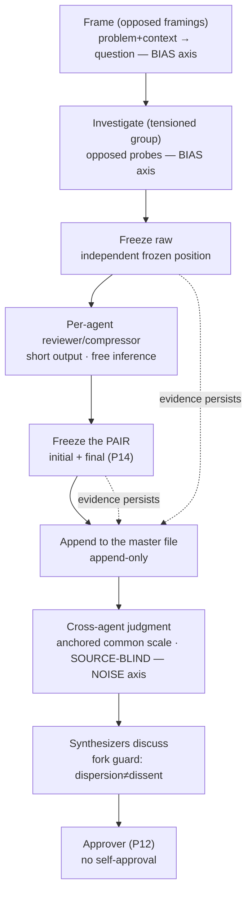

# Thesis — The orchestrator as a noise-reduction machine

> **Status:** `candidate`, `exploratory`. This **does not legislate** — it reasons. It is
> the hypothesis from which a future constitution will *promote* rules, not the rule
> itself. Every claim below is meant to be **discussed**, not ratified. `Claim ≤ proof`:
> each "you already do X" points to a real artifact in the repo; where there is no
> artifact, it is marked **PENDING**.

## Opening

The agent orchestrator this repo builds makes **judgments** all the time: which
finding is solid, which implementation is better, what to synthesize, how to classify
the knowledge produced. Every judgment carries two independent errors — **bias**
(directional error, correlated) and **noise** (unwanted dispersion, variability
without signal). The repo's current architecture attacks **bias** masterfully — and
**has no named noise axis**. This thesis proposes the second axis, and claims that the
two compose:

> **`judgment residue = bias ⊕ noise`** — and reducing them calls for **distinct
> tools**, applied at **distinct stages** of the agent pipeline.

> **Revision (2026-07-20, promoted by the `seam-feasibility` research).** `⊕` **is
> not a free orthogonal direct sum**. It holds as an Amari Pythagorean theorem **under
> an imported Legendre potential `F`** (dually flat geometry; **without** a Fisher
> metric) — and that `F` is precisely the *"anchored common scale / MAP"* already used
> in this thesis, which thus pays the toll without naming it. **Without `F`**, the
> honest form is `residue = bias * noise`: two entropic (KL) contributions, **not**
> orthogonal legs. Proof and boundaries in
> `docs/essays/anti-noise-orchestrator/research/seam-feasibility/findings.md`.

The thesis is falsifiable (see *Collapse-tests*). It is also a **self-application**:
the process that produces knowledge here is an instance of the epistemological
framework it studies (PLAN.md §1, "framework as its own instance", A6).

## Context — what already exists (the bias axis)

The repo already runs a mature anti-bias discipline, which I am **not** reinventing:

- **Pairwise tension** (`anti-bias-vector-composition`): when N agents share a
  macro-objective, their micro-vectors (angle, methodology, corpus) are
  **structurally opposed** so that one agent's internal bias is forced to the
  surface by another — not merely *non-overlapping*. More agents does not break the
  correlation; structural opposition does.
- **Executable gate** (`check-tension`): two independent agents run Tests 1–4, and
  only a "both PASS" reaches the human confirm (constitution P5).
- **Universal invariants** (`domainspec-subagents-strategy`): `claim ≤ proof` (P10),
  final approval without self-approval (P12), a closed-vocabulary `exit_reason`
  including `dissent_irreconcilable`, and the **initial AND final positions**
  primitive for collapse detection (P14).
- **Append-only dispatch ledger** (`register-dispatch`, schema v0.6.0) with
  per-agent `token_budget` and per-group `robot_talks`.

All of this is **anti-bias**. What's missing is the **anti-noise** — and the instinct
that originated it ("individual evaluations, aggregation at the end; sometimes with
discussion in between") is *exactly* the canonical noise-reduction lever (Kahneman,
Sibony, Sunstein, *Noise*, 2021): the average of N **independent** judgments cancels
noise on the order of √N.

> **Revision (2026-07-20, `seam-feasibility`).** `√N` is an **L2/CLT** fact — it
> holds under the Gaussian/quadratic regime (`F=‖·‖²`, where the mean is the Banerjee
> minimizer). **Outside the CLT** (entropic regime), concentration is **Sanov /
> large-deviation, not 1/N**. State `√N` as the special case; the general guarantee is
> "aggregation = m-projection onto the flat family, monotone under independence,"
> with a **regime-dependent exponent**. The design (aggregating independents)
> survives; the exponent is conditional.

## The central thesis

Three references, operating at **three orthogonal levels** — not a ranked list. They
**compose**, they don't compete:

| Axis | Role | Question it answers |
|---|---|---|
| **Category theory** | *in what* — the substrate/type | what the objects and morphisms **are** (already the repo's spine: `residue`, Yoneda, functor) |
| **Kahneman** | *why / what* — the error model | how judgment fails (`bias ⊕ noise`) and which protocols correct it (MAP, ETE, hygiene) |
| **Thaler / Nudge** | *how* — choice architecture | how to make hygiene the **effortless default**, not a costly choice |

CT is the **ground** (everything types onto it), Kahneman is the **primary lens**
that motivates the design, Thaler is the **mechanism** that implements Kahneman's
prescriptions. "Kahneman first" holds as the motivating lens; CT is not
"third/lesser" — it is the ground.

### `bias ⊥ noise` — the reframe that reorganizes everything

The central point of *Noise* is that bias and noise are **orthogonal** and call for
opposite tools:

- **Bias** → **tension, opposition, red-team.** (what the repo already does)
- **Noise** → **independence + aggregation, anchored common scale, decision
  hygiene.**

And here is the core of the design: **tension and independence contradict each
other.** Anti-bias *correlates* agents in deliberate opposition; anti-noise
aggregation demands the opposite — independence (the average only cancels noise to
the extent of independence; correlation ρ puts a floor on the gain). The resolution
is **separation by stage**:

- **Generate/investigate stage** → governed by **tension** (opposed probes — as
  today).
- **Evaluate/judge stage** → governed by **independence** (independent scorers,
  common scale, source-blind).

Two axes, two stages, two populations. This separation dissolves the contradiction
and is the most load-bearing design principle of this thesis.

> **Revision (2026-07-20, `seam-feasibility`).** "Orthogonal" here is **licensed,
> not free**: `bias ⊥ noise` is only a direct sum under the potential `F` (= the
> *anchored common scale*) and with the divergence oriented in the **first slot**
> (M-projection/reverse-KL); reversed, the cross term reappears (Jensen gap). And
> there is an **open** structural limit: orthogonality has to survive **composition
> across stages** to be categorical — native monotonicity (the data-processing
> inequality: channels *contract* KL) rotates the residue out of ⊥.
> Separation-by-stage is the *design* answer; the *formal* guarantee through
> composition is **unproven** (see new collapse-test).

### The discipline of the nudge — process, never content

A nudge presupposes an architect who already knows the good outcome and pushes
toward it. But the point of *Noise* is that you **don't know** the right answer —
you're reducing error you can't see. So if you "nudge" the *finding*, you inject
exactly the bias you're trying to cancel. The rule:

> **The nudge governs the architecture of the PROCESS, never the CONTENT of the
> judgment.**

Legitimate nudges (process): default = independent judgment logged first;
**deliberate sludge** = you *cannot* open the discussion without freezing your
position first; `token_budget` = scarcity that forces compression; salience = the
human-gate button. And note: the repo **already does Thaler without naming it** —
the `check-tension` gate that *blocks*, the append-only ledger, the human-gate as a
button are choice architecture. Naming the axis just makes explicit what is already
latent.

> **Revision (2026-07-20, `seam-feasibility`).** "Nudge = morphism over the
> process" **does not type inside a single-judgment optic** — there the 2-cell is
> the *coend witness* itself and collapses (either it's the identity, or it touches
> the content). The teeth are **real one floor up**, in the **coupling fiber** of the
> joint law `D(A^N)`: the independence nudge `J ↦ ⊗ᵢ(πᵢ∗J)` **fixes every marginal
> (content)** and **kills the correlation (process)**, well-defined because
> marginalization is **non-monic**; the variance drop in aggregation is itself the
> detector. **Re-typing:** split the nudge vocabulary into (a) *coupling-fiber
> nudges* over `D(A^N)` for aggregation — independence, freeze-before-the-channel
> (adjustment 1 = kill an anchoring coupling before it forms), blinding, and the
> persona neutralization of OQ-3 (= ⊗-marginalizing a correlated prior); and
> (b) *optic/lens nudges*, only for the per-agent explorer→reviewer pipeline
> (adjustment 2, compressor≠judge), where the optic is honest.

## The frame and the refine — the front of the pipeline and the cross-cutting operator

Before investigating, there is an act that the previous version of this thesis did
not name: **framing**.

**Frame.** Given a context and a problem, what is the best way to frame the
question/point of view? The frame's output **is not a topic**, it is a **well-formed
question**. (*Anchor annotation, post-revision:* the closest `question` field lives
in the `discovery` kind, and there it is **optional** — the `research` kind does
**not** require it; we do not inherit the `discovery` chain from the other vault,
see `[[OQ-6]]`.) Framing is the choice of **lens** — in the repo's vocabulary, the
choice of codomain `C` (README "common thread"; `FRAMINGS.md`). And, because framing
**is a judgment**, it carries the thesis's **two** components (`bias ⊕ noise`) — so
it gets **two** treatments, not just one:

- **Bias arm (tension).** Frames are directional; **opposed** framings expose the
  bias of whoever is framing. This is the arm the mermaid diagram shows (`F0`, BIAS
  axis).
- **Noise arm (independence) — PENDING.** Two competent analysts, with no shared
  bias, frame the same problem in **dispersed** ways: that is noise, not opposition.
  The same engineering from `[[OQ-4]]` applies here — **N independent frames, logged
  blind**, and **frame dispersion as a first-class signal** (high dispersion =
  ill-posed problem; you don't average questions). This arm is new and not yet
  built.

An ill-posed frame poisons the entire downstream source filter.

**Refine — cross-cutting operator, not a stage.** `refine` improves an artifact
through iteration and, in principle, applies to any node (frame, research,
findings). *Post-revision caveat (anchor honesty):* the real `refine` skill is
**not** a "loop until convergence" — it is a **fixed canonical conveyor
(~10 stages)** capped by *preset budget*, run once; and the `loop_cap`/`max_loops`
dials belong to the **dispatch loop between groups**, not iteration counters for a
single artifact. So, as a form of termination, refine today **completes the fixed
conveyor + budget**. A **convergence criterion for a solo artifact** ("stop when a
pass raises no new inconsistency") is desirable but **PENDING** — it is not what
`zig_zag` nor the repo's `refine` skill do today.

**The citation spine — candidate discipline (not a closed invariant).** Pipeline
evidence should hang off a referencing discipline that crosses research→findings:

- **Paper key.** Every paper/source has a stable identifier; precedence
  **DOI > arXiv ID > URL > content-hash** (fallback). The key enables **dedup**
  (same key = same paper) and the query "has this already been researched?".
- **Research → findings flow.** In the aggregated `research`, agents **write down
  the sources consulted** — each with a key and status (used / discarded + why).
  These sources **propagate** to `findings` via `derives-from`; the synthesis does
  not invent sources.
- **Every statement referenced — with two safeguards.** Every claim in `findings`
  carries **≥1 key**; a claim with no key = **suspect**, not silently accepted. But
  raw fail-closed **manufactures exactly the availability bias the thesis fights**
  (Goodhart): it forces discarding a claim that is true-but-unanchorable, or
  slapping on the nearest key just to pass — and a GREEN coverage dashboard ends up
  measuring *compliance*, not truth. Two mandatory safeguards, then:
  1. **Link quality, not just presence.** The observability output distinguishes
     `supports` (the source actually substantiates the claim) from `mentioned`
     (merely cited) — coverage measures **well-referenced**, not referenced.
  2. **A valve for truth-by-reasoning.** A legitimate inferential claim uses an
     explicit `reasoning`/self-evidence key — so as not to **strangle inference**
     (consistent with adjustment 3), making the *type* of anchor visible instead of
     forcing citation theater.

This reinforces two lines already present: traceability/blinding and the
a-priori↔a-posteriori divergence from `[[OQ-4]]`.

## The pipeline as a worked example — two-level hierarchical ETE

The research flow designed in the sessions is, formally, a two-level
**Estimate-Talk-Estimate** (Delphi): register independently → discuss →
re-register, within each agent, and again among the synthesizers.

The **five adjustments** that make the flow honest under the noise axis:

1. **Freeze before the channel.** The reviewer *is a channel*. The agent's raw
   finding is frozen **before** the conversation with the reviewer opens —
   otherwise the reviewer anchors the agent and √N evaporates. The file stores the
   **pair** (pre and post), which is the P14 primitive.
2. **Compressor ≠ judge.** A 1:1 reviewer dedicated to "its" agent turns into an
   **advocate** and produces an isolated absolute score (very high noise). Separate
   them: *compressing* is per-agent (fine, modelable as a P11 helper); *judging on a
   common scale* is cross-agent and comes later.
3. **Short output ✅, strangled inference ❌.** Tightening output tokens is a good
   nudge (compression). Cutting the *reasoning* of whoever is judging increases
   noise (System-2 under-engaged). Budget the output; don't strangle the
   evaluator's deliberation.
4. **TTL vs. evidence.** Reasoning drafts expire (a matter of days). But the
   initial+final pair that *substantiates* the noise reduction is **proof** —
   without it there's no auditing whether the process obeyed the thesis (A6). The
   TTL erases the draft; the pair (or its digest) **persists**.
5. **Fork guard.** Aggregation reduces noise but can **crush the correct minority**.
   Distinguish **dispersion** (noise → average it) from **fork** (signal → escalate
   as `dissent_irreconcilable`). Without this guard, the anti-noise program
   degenerates into premature consensus — the very failure *Noise* warns about.

## Where each principle's design lives

The operational spine: one line per principle, pointing to the real artifact **or**
flagging what's left to build.

| Principle | Axis | Why | Where the design lives |
|---|---|---|---|
| Pairwise tension | K·CT | correlated bias cancels under opposition | `check-tension` (Tests 1–4), `anti-bias-vector-composition`, P5 |
| Independence-by-stage | K | √N only holds with independence | **PENDING** — the new axis of this thesis |
| ETE / freeze-before-discussing | K | cascade/anchoring before registration | primitive **exists** (P14 initial+final); the freezing rule is **PENDING** |
| MAP / anchored common scale | K | relative judgment is less noisy; decompose into independent dimensions | **PENDING** — candidate: the 6 facets of `knowledge-taxonomy` |
| Blinding (source-blind) | K·T | kills halo/source-bias | **PENDING** — ledger records `agent_name`/`model`; blind evaluation is new |
| Mechanical aggregation > clinical | K | simple rule beats holistic fusion | partial: `robot_talks:true`→synthesize / concat (P7); fork guard **PENDING** |
| Fork guard | K | don't crush the correct minority | `exit_reason: dissent_irreconcilable` **exists** |
| Hygiene default | T | make the hygienic path the default | human-gate + `check-tension` that **blocks** (already choice architecture) |
| Deliberate sludge | T | friction that forces the correct sequence | **PENDING** — gate that blocks discussion before freezing |
| Token-budget as nudge | T | scarcity forces compression/decision | `token_budget` in schema v0.6.0 **exists**; use as a nudge is design |
| CT operationalization (~1:1 analogy) | CT | informal Kahneman → objects that compose/measure; use **only where the mapping is tight**, otherwise it stays informal | **operational** (`seam-feasibility`): ⊕↦Amari-Pythagorean under `F`, √N↦regime-dependent concentration, aggregation↦m-projection, nudge↦morphism on the coupling fiber; **OPEN**: ⊥ surviving composition (DPI). See `[[BET-CT]]` |
| Frame (framing the question) | K·CT | an ill-posed lens poisons everything downstream; framing is a judgment (bias ⊕ noise) | **PENDING** — new stage; tension arm + independent-dispersion arm (`[[OQ-4]]`) |
| Refine (loop operator) | — | improvement through bounded iteration, cross-cutting any node | skill `refine` **exists** (fixed conveyor + budget); solo convergence **PENDING** (not the zig-zag nor the dispatch dials) |
| Citation spine (key + flow + claim↦ref) | K | evidence without an anchor is not evidence (`claim ≤ proof`) | partial: `derives-from` **exists**; key + link-quality (`supports`/`mentioned`) + `reasoning` valve **PENDING** |

## Open questions

Each one carries a **recommendation**, not just the question. None is decided.

**OQ-1 — Is the per-agent reviewer a pure compressor, or already a judge?**
*Recommendation:* **pure compressor** (the agent's assumed advocate), with true
judging deferred to the cross-agent step. Keeps the noise axis clean and avoids an
isolated absolute score.

**OQ-2 — Is the common scale a fixed global rubric, or per `dispatch_type`?**
*Recommendation:* **per `dispatch_type`** — `research` (novelty, evidence, reach)
and a future `implementation-tournament` (correctness, internal consistency, cost)
have genuinely different dimensions; a single rubric would become too generic to
measure anything.

**OQ-3 — Agent-pool persona: who picks it, and at which stage does it apply?**
Each agent picks a name from `agent-pool.yaml` as its **persona**, tied to a role
(`role_fit`: explorer/skeptic/writer/auditor). A persona is a **prior** —
double-edged: it diversifies the *generate* stage (opposed priors help tension), but
**injects correlated bias** into the *judge* stage (which should be
independent-on-a-common-scale). *Recommendation:* persona **assigned by the
dispatcher** (not self-selected — self-selection collapses diversity: everyone
grabs the "strong generalist"), **active in investigate/tension** and
**neutralized/blind in evaluate/tag**. Open fork: does the persona tie to
`role_fit` by default, or is it free?

**OQ-4 — Is it worth classifying each output's knowledge (explorer + reviewer)
into a taxonomy? If so, how to tag it?**
Reconnaissance of `knowledge-taxonomy` (`github.com/cyberAlchemyAI/knowledge-taxonomy`,
not directly accessible; triangulated via local audits): it has **3 layers** — 8
top-level types, 6 **facets** (`domain, nature, normativity, temporality,
source_confidence, content_certainty`), 12 edge families. The **6 facets are the
credible part**: controlled enums, strict validation, and — the strongest data
point — **empirical convergence** (4 independent classifiers, "zero axis changes"
across 58 artifacts / 35+ domains). The 8 types and 12 edges are **fuzzy**
(multi-label + a rule engine that's still spec-only). Background caveat: the KT was
designed to **eliminate** inter-tagger variance via shared rules — using it to
**measure** disagreement among independent agents is a bit *off-label*.
*Recommendation (and answer to "everyone tags and we average"):*
  - **Yes, it's worth it** — but only if the tag *does something* downstream
    (retrieval, routing, vault structure). A decorative tag is ceremony; the number
    of taggers is a **dial** proportional to what the tag feeds, not fixed.
  - Use the **6 facets** as the anchored common scale. **Don't** use the 8 types /
    12 edges as a disagreement scale (multi-label makes two taggers "agree"
    incorrectly).
  - "Average" of a categorical label **is not an average** — it's a
    **vote/distribution**. And the distribution *is* the noise measure
    (inter-tagger reliability): strong agreement = low noise = high confidence;
    spread = ambiguous item **or** a bad boundary.
  - **Independence here too.** Tags logged **blind** and frozen before any
    comparison. The "last agent to compare" needs to **judge first (frozen), then
    compare** — otherwise it is itself anchored by the stack.
  - **The pre/post boundary is signal, not noise.** The dispatcher tags *a-priori*
    (prediction of the knowledge); explorer/reviewer tag *a-posteriori* (from the
    output). The **divergence** predicted↔produced measures whether the research
    went where expected or **discovered off-axis** (residue/serendipity). **Don't**
    average across that boundary — two aggregates (a-priori and a-posteriori) and
    the distance between them as a first-class quantity.

**OQ-5 — Does implementation fusion happen now, or does it stay `code`-RESERVED?**
In the worktree case ("dispatch K groups, pick the best or merge"), `code` is
**RESERVED** in the constitution. *Recommendation:* frontier — **blind rubric
selection** as default (an argmax robust to noise if the selection is blind);
**fusion** only when the dimensions are separable and each piece carries its own
proof (`claim ≤ proof` per piece), because cherry-picking destroys internal
consistency (a real software risk).

**OQ-6 — Is the frame the root of the pipeline, or is there something before it?**
The earlier reading suggested `discovery` as the lineage root
(`findings→research→discovery`, the `domainspec-core` vault's model) — **rejected
for this repo** (their model isn't ours). It's kept as an idea to reconcile, not
imported: whether there is an act of *problem recognition* prior to *framing*, or
whether the frame is itself the root.
*Recommendation:* treat **frame as the front** for now and leave "what precedes the
frame" as an open fork — don't inherit the `discovery` chain from the other vault
without deciding it's ours.
*Live risk (not just archival):* the frame receives "a problem" as **given** — but
**problem-recognition sits upstream of the first governed stage and today has no
owner**. "An ill-posed frame poisons the downstream" moves up one level: a
poorly-recognized *problem* poisons the frame. An unaudited root input is an open
risk, not a taxonomy question. `[[discovery-as-root]]`

**OQ-7 — What is the canonical paper key, and where does dedup live?**
Proposed precedence **DOI > arXiv > URL > hash**; but neither MOGT-scaffolding nor
CANONICAL-KINDS brings a bibliographic schema or deduplication — it's a piece to be
invented. *Recommendation:* a stable per-source key in the append-only ledger;
dedup by key on entry; an orphan claim (no key) rejected by the
observability-output validator. `[[citation-spine]]`

**OQ-8 — How to build the frame's noise arm (independent frames +
dispersion-as-signal)?**
In the design, the frame gained a second arm beyond tension: N **independent**
framings, logged blind, with **frame dispersion as a first-class signal** (à la
`[[OQ-4]]`) — high dispersion = ill-posed problem. Marked PENDING in the text and
the table; still to design: how many frames, how to measure dispersion of questions
(non-averageable), and the trigger that separates "ill-posed" from "rich".
*Recommendation:* reuse the dispersion-as-noise engineering from OQ-4, don't invent
a new metric. Raised by the red-team in `2026-07-20-anti-ruido-frame-refine-review`.
`[[frame-noise-arm]]`

> The four OQs below were raised by the delta red-team
> `2026-07-20-hyp-orch-noise-delta-review` (attackers: Fritz on CT-substance, Popper
> on falsifiability) over the *Registered bets* section and the CT table row. Parked
> here to refine, not yet fixed.

**OQ-9 — Is `[[BET-CT]]` actually falsifiable, or does its retreat clause immunize it?**
The bet states a *universal* ("for every noise construct there exists a ~1:1 CT
tool") while its falsifier only fires *per-construct*, and "If it falls (local)… we
don't surrender to CT" excuses every hit — so no accumulation of per-construct
failures can refute the universal. It also counts the nudge (whose single-judgment
optic *collapsed* before being re-typed) as a "survived" mapping; and its *Carries*
double-counts √N/aggregation (which belong to `[[BET-√N]]`), while the table row
lists **4** survived mappings vs BET-CT's **3** (aggregation↦m-projection dropped).
*Recommendation:* re-scope BET-CT strictly per-construct **or** pre-commit a
threshold ("false if ≥k named constructs collapse"); record the nudge as "candidate 1
falsified, re-typed", not a clean survival; reserve "survived" for after a decision
actually moves (the predict/correct test, not mere existence of a map); reconcile the
mapping list between the table row and BET-CT.

**OQ-10 — Do the `seam-feasibility` formal identifications hold? (challenges a
promoted research finding — owner's call)**
The same red-team flagged four fidelity gaps in the promoted `seam` revisions,
none yet adjudicated:
- **`F = anchored common scale / MAP`** is asserted by naming, not constructed —
  Amari-Pythagoras needs `F` to be a convex Legendre potential *generating* the
  divergence; the MAP is a scoring construct not shown to be convex / differentiable
  / divergence-generating.
- **Nudge well-definedness** is justified by an irrelevant property ("well-defined
  because marginalization is non-monic") — the join→product-of-marginals map is
  well-defined unconditionally; non-monicity explains the *earlier* optic collapse,
  not the soundness.
- **Banerjee** is pinned to `F=‖·‖²`, but the mean minimizes expected Bregman loss
  for *every* Bregman divergence; regime-dependence lives in the *rate*, not the
  minimizer.
- **CLT vs Sanov** are framed as mutually exclusive regimes — they coexist (CLT
  governs typical `1/√N` fluctuations, the LDP governs the tails); `√N` is an
  L2/Bienaymé fact needing only finite variance.
*Recommendation:* these challenge a **promoted** research finding, so route them back
to `seam-feasibility` to defend or correct (don't silently overwrite) — either
display `F` explicitly (convex potential + its Bregman divergence + the m-flat
submanifold) or fall back to the honest `residue = bias * noise`; separate the
(F-independent) minimizer from the (F-dependent) rate; reword CLT/Sanov as coexisting.

**OQ-11 — Can `[[BET-THALER]]`'s falsifier ever terminate?**
Its falsifier ("across N design decisions, the lens never blocks nor alters a choice
we wouldn't have blocked without it") has unbounded N (never declarable false) and
rests on an unobservable counterfactual ("wouldn't have blocked without it").
*Recommendation:* pre-register a fixed N and the specific candidate decisions, judged
blind before the lens is applied.

**OQ-12 — Does `[[BET-TAG]]`'s falsifier isolate rater-noise from boundary-defect?**
Sharper anchors also fix *boundary* defects (a sharper facet = a sharper boundary),
so "anchors don't help ⇒ it's ambiguity/boundary" doesn't cleanly separate the three
buckets the bet trichotomizes.
*Recommendation:* add a control that moves anchor quality independently of rater
count/training, so residual spread can be attributed.

## Collapse-tests (what falsifies this thesis)

- If "independence" and "tension" **cannot** coexist through separation-by-stage —
  that is, if the same group needs to be opposed *and* independent at the same
  time — the two-axis design collapses and becomes rhetoric.
- If tag distribution does **not** correlate with any observable downstream
  quality, tagging is decoration and falls (OQ-4).
- If the initial+final pair never diverges in practice (always collapses), the ETE
  is measuring nothing and becomes ceremony (adjustments 4/5).
- If opposed framings always converge on the same question (every frame yields the
  same `question`), the **frame** stage separates nothing and becomes ceremony —
  refine over it too.
- And the opposite failure mode (noise arm): if **independent** frames never
  disperse, the frame's noise arm measures nothing; if they disperse always with no
  recoverable signal, it's a chronically ill-posed problem — in neither case does
  dispersion-as-signal (`[[OQ-4]]`) hold up.
- **(new, `seam-feasibility`) Compositionality.** If the `bias ⊕ noise`
  decomposition and the nudge re-typing only hold **pointwise per stage** and do
  **not** survive the functorial composition of stages/dispatch, then
  separation-by-stage is a design tool with no formal guarantee — and the thesis
  does not discharge OBL-E3 (which is exactly this question one floor up).
  *Falsifies:* exhibiting two stages whose composition destroys orthogonality (the
  DPI suggests it exists). *Survives:* a proof that the bias/noise of the composite
  is built from the bias/noise of the parts.

## Registered bets

Bets are this thesis's **load-bearing assumptions**, held at *proof-zero* and
stated so they can be falsified — "first assume true, then think about how to
falsify, then the experiment." Schema: *Bet* (assumed true) · *Carries* (what
depends on it) · *Status* · *Falsifier* · *Experiment* (deferred) · *If it falls*
(residue). The *Collapse-tests* above are the thesis-level falsifiers; here each
assumption carries its own — pointing to the collapse-test when one already exists,
to avoid duplication (single source).

**BET-CT — operationalization by ~1:1 analogy.**
- *Bet:* for every noise construct there exists a CT tool that maps **≥ ~1:1** and
  **corrects/predicts** (not just re-labels). CT is *how* we operationalize
  Kahneman — neither the motivating axis nor a scenario; it's "more than an
  analogy" only where the fit is tight.
- *Carries:* the passage from informal-thesis → computable architecture; the `⊕`,
  the `√N`, the aggregation.
- *Status:* **survived once** (`seam-feasibility`: ⊕↦Amari-Pythagorean under
  `F`, √N↦regime-dependent concentration, nudge↦coupling-fiber). **In-test:**
  persona, tag, fork-guard.
- *Falsifier (per construct):* false **for that construct** if the candidate tool
  **collapses into identity** or has to **touch the content** (which is what the
  single-judgment optic did to the nudge — hence moving up a floor). Thesis-level
  falsifier = the **compositionality** collapse-test (⊥ doesn't survive composition
  / DPI).
- *Experiment (deferred):* for the next construct, exhibit the formal map and test
  whether it changes ≥1 decision; for composition, exhibit two stages whose
  composition destroys orthogonality.
- *If it falls (local):* that construct stays **informal / Kahneman-only** — no
  loss to the rest; the discipline is selective by construction (**we don't
  surrender to CT**).

**BET-√N — independence gives a material noise reduction.**
- *Bet:* independent evaluators, common scale, source-blind, reduce noise with gain
  **∝ √N_effective** (exponent conditional on regime — see the `seam`
  revision).
- *Carries:* the entire anti-noise lever (aggregation, MAP, scorer panel).
- *Status:* **in-test**.
- *Falsifier:* false if **N_effective ≈ 1** — error covariance between scorers
  (same base model, different personas) high enough that the average doesn't beat
  a single good scorer.
- *Experiment:* N scorers score a labeled set; measure error covariance vs.
  reference; compare average-error vs. best-individual-error.
- *If it falls:* swap independence for **structural diversity** (distinct
  evidence/corpora/tools) as the primary decorrelation source; or re-budget,
  accepting a small gain.

**BET-PERSONA — persona diversifies generation, not just style.**
- *Bet:* opposed personas diversify the sampled *content distribution*, not just
  surface register.
- *Carries:* persona as a source of tension in the generate stage (`[[OQ-3]]`).
- *Status:* **in-test** (red-team flagged it as unproven).
- *Falsifier:* false if, holding task+evidence fixed and varying **only** the
  persona, the substantive outputs (claims, choices — not style) are statistically
  indistinguishable.
- *Experiment:* same task prompt, only the persona varies; measure content
  divergence vs. style divergence; content ≈ 0 → falsified.
- *If it falls:* move diversity to the structural axis; demote persona to
  cosmetic.

**BET-TAG — tag dispersion measures noise (not ambiguity).**
- *Bet:* the spread of tags across independent agents is dominated by
  **rater-noise** (reducible), not by item-ambiguity or boundary-defect.
- *Carries:* `[[OQ-4]]` (the "distribution = noise measure"); using the
  distribution as reliability.
- *Status:* **in-test**.
- *Falsifier:* false if **sharpening the anchors** (the 6 facets) doesn't reduce
  the spread — if it's ambiguity/boundary, a better anchor doesn't help.
  (Complements the collapse-test that the distribution needs to correlate with
  downstream quality.)
- *Experiment:* same set, vague vs. sharp anchors; measure the change in spread.
- *If it falls:* separate the 3 buckets (noise / ambiguity / boundary) before
  aggregating.

**BET-THALER — the nudge lens becomes a design constraint, not just
re-description.**
- *Bet:* naming "nudge governs process, not content" generates a **checkable
  constraint** on future decisions (not just re-describing existing gates).
- *Carries:* the legitimacy of the Thaler axis as more than pedagogical.
- *Status:* **in-test** (red-team flagged the axis as mostly a relabel).
- *Falsifier:* false if, across N design decisions, the lens never **blocks nor
  alters** a choice we wouldn't have blocked without it.
- *Experiment:* log decisions and mark which ones the process-not-content rule
  changed.
- *If it falls:* demote Thaler from axis to **lens** (useful vocabulary), keeping
  only the sludge/freeze-gate as prescription — which is downstream of Kahneman.

**BET-FORK — the fork guard is mechanizable without an oracle.**
- *Bet:* **structural** signals (bimodality + explicit incompatible claims)
  separate real-fork from dispersion without needing to know which side is right.
- *Carries:* adjustment 5 (fork guard); avoids crushing the correct minority.
- *Status:* **in-test** (red-team: as written, it requires the oracle the premise
  denies).
- *Falsifier:* false if, on a labeled case set, structurally-flagged forks don't
  correlate with real decision-forks.
- *Experiment:* labeled fork/dispersion cases; measure precision/recall of the
  structural detector.
- *If it falls:* the guard becomes a **human-escalation trigger**, not an
  automatic decision.

## Connections

- **Derives from:** the 2026-07-19/20 design sessions (anti-bias → anti-noise) and
  the existing core: `.claude/skills/anti-bias-vector-composition/`,
  `.claude/skills/check-tension/`, `.claude/skills/domainspec-subagents-strategy/`,
  `.claude/skills/robot-talks/`.
- **Grounds in:** `PLAN.md` (§1 A6, §4 CT discipline),
  `telemetry/agents/agent-pool.yaml` (personas),
  `telemetry/agents/subagents-dispatch.yaml` (ledger).
- **Would promote to:** a future *anti-noise constitution* (executable rules),
  `DEFINITIONS` entries (`noise`, `nudge`, `sludge`, `MAP`, `ETE`, `common-scale`,
  each with a categorical type) and `MAPPING.md`. None of this is written here —
  this is the hypothesis, not the law.
- **External references:** Kahneman, Sibony & Sunstein, *Noise* (2021); Thaler &
  Sunstein, *Nudge*; `knowledge-taxonomy` @ `cyberAlchemyAI` (facets as a candidate
  scale, `[[OQ-4]]`).
