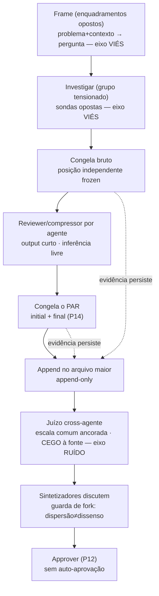

# Tese — O orquestrador como máquina de redução de ruído

> **Estatuto:** `candidate`, `exploratory`. Isto **não legisla** — raciocina. É a
> hipótese de onde uma constituição futura vai *promover* regras, não a regra. Toda
> afirmação abaixo é para se **discutir**, não ratificar. `Claim ≤ proof`: cada "você
> já faz X" aponta um artefato real do repo; onde não há artefato, está marcado
> **PENDENTE**.

## Abertura

O orquestrador de agentes que este repo constrói toma **juízos** o tempo todo: qual
achado é sólido, qual implementação é melhor, o que sintetizar, como classificar o
conhecimento produzido. Todo juízo carrega dois erros independentes — **viés** (erro
direcional, correlacionado) e **ruído** (dispersão indesejada, variabilidade sem sinal).
A arquitetura atual do repo ataca **viés** com maestria — e **não tem o eixo de ruído
nomeado**. Esta tese propõe o segundo eixo, e afirma que os dois compõem:

> **`resíduo de juízo = viés ⊕ ruído`** — e reduzi-los pede **ferramentas distintas**,
> aplicadas em **estágios distintos** do pipeline de agentes.

> **Revisão (2026-07-20, promovida pela pesquisa `costura-feasibility`).** O `⊕` **não é
> soma-direta ortogonal grátis**. Ele vale como um Pitágoras de Amari **sob um potencial de
> Legendre `F` importado** (geometria dualmente plana; **sem** métrica de Fisher) — e esse
> `F` é a própria *"escala comum ancorada / MAP"* já usada nesta tese, que assim paga o
> imposto sem nomear. **Sem `F`**, a forma honesta é `resíduo = viés * ruído`: duas
> contribuições entrópicas (KL), **não** pernas ortogonais. Prova e fronteiras em
> `docs/essays/orquestrador-anti-ruido/research/costura-feasibility/findings.md`.

A tese é falsificável (ver *Collapse-tests*). Ela é também uma **auto-aplicação**: o
processo que produz conhecimento aqui é uma instância do framework epistemológico que
ele estuda (PLAN.md §1, "framework as its own instance", A6).

## Contexto — o que já existe (o eixo do viés)

O repo já opera uma disciplina anti-viés madura, que **não** estou reinventando:

- **Tensão pairwise** (`anti-bias-vector-composition`): quando N agentes compartilham
  um macro-objetivo, seus micro-vetores (ângulo, metodologia, corpus) são **opostos
  estruturalmente** para que o viés interno de um seja forçado à tona por outro — não
  apenas *não-sobrepostos*. Mais agentes não quebram a correlação; oposição estrutural
  quebra.
- **Gate executável** (`check-tension`): dois agentes independentes rodam os Testes 1–4
  e só um "ambos PASS" chega ao human confirm (constituição P5).
- **Invariantes universais** (`domainspec-subagents-strategy`): `claim ≤ proof` (P10),
  aprovação final sem auto-aprovação (P12), `exit_reason` de vocabulário fechado incluindo
  `dissent_irreconcilable`, e a primitiva **initial AND final positions** para detecção de
  colapso (P14).
- **Ledger append-only** de dispatch (`register-dispatch`, schema v0.6.0) com `token_budget`
  por agente e `robot_talks` por grupo.

Tudo isso é **anti-viés**. O que falta é o **anti-ruído** — e o instinto que o originou
("avaliações individuais, agregação ao final; às vezes com discussão no meio") é
*exatamente* a alavanca canônica de redução de ruído (Kahneman, Sibony, Sunstein, *Noise*,
2021): a média de N juízos **independentes** cancela ruído na ordem de √N.

> **Revisão (2026-07-20, `costura-feasibility`).** O `√N` é fato **L2/CLT** — vale sob o
> regime gaussiano/quadrático (`F=‖·‖²`, onde a média é o minimizador de Banerjee). **Fora do
> CLT** (regime entrópico) a concentração é **Sanov / large-deviation, não 1/N**. Enunciar
> `√N` como o caso especial; a garantia geral é "agregação = m-projeção na família plana,
> monótona sob independência", com **expoente dependente de regime**. O design (agregar
> independentes) sobrevive; o expoente é condicional.

## A tese central

Três referências, operando em **três níveis ortogonais** — não uma lista ranqueada. Elas
**compõem**, não competem:

| Eixo | Papel | Pergunta que responde |
|---|---|---|
| **Teoria das categorias** | *em quê* — o substrato/tipo | o que os objetos e morfismos **são** (já é a espinha do repo: `resíduo`, Yoneda, functor) |
| **Kahneman** | *por quê / o quê* — o modelo de erro | como o juízo falha (`viés ⊕ ruído`) e quais protocolos o corrigem (MAP, ETE, higiene) |
| **Thaler / Nudge** | *como* — a arquitetura de escolha | como tornar a higiene o **default sem esforço**, não uma escolha custosa |

CT é o **chão** (tudo tipa nele), Kahneman é a **lente primária** que motiva o design,
Thaler é o **mecanismo** que implementa as prescrições de Kahneman. "Kahneman primeiro"
vale como lente motivadora; CT não é "terceiro/menor" — é o solo.

### `viés ⊥ ruído` — o reframe que reorganiza tudo

O ponto central de *Noise* é que viés e ruído são **ortogonais** e pedem ferramentas
opostas:

- **Viés** → **tensão, oposição, red-team.** (o que o repo já faz)
- **Ruído** → **independência + agregação, escala comum ancorada, higiene de decisão.**

E aqui está o núcleo do design: **tensão e independência se contradizem.** O anti-viés
*correlaciona* agentes em oposição deliberada; a agregação anti-ruído exige o oposto —
independência (a média só cancela ruído na medida da independência; a correlação ρ põe
um piso no ganho). A resolução é **separar por estágio**:

- **Estágio gerar/investigar** → governado por **tensão** (sondas opostas — como hoje).
- **Estágio avaliar/julgar** → governado por **independência** (scorers independentes,
  escala comum, cegos à fonte).

Dois eixos, dois estágios, duas populações. Essa separação dissolve a contradição e é o
princípio de design mais carregado desta tese.

> **Revisão (2026-07-20, `costura-feasibility`).** "Ortogonal" aqui é **licenciado, não
> grátis**: `viés ⊥ ruído` só é soma-direta sob o potencial `F` (= a *escala comum ancorada*)
> e com a divergência orientada no **primeiro slot** (M-projection/reverse-KL); invertida, o
> termo cruzado reaparece (gap de Jensen). E há um limite estrutural **aberto**: a
> ortogonalidade tem de sobreviver à **composição dos estágios** para ser categórica — a
> monotonicidade nativa (desigualdade de processamento de dados: canais *contraem* KL) gira o
> resíduo para fora de ⊥. A separação-por-estágio é a resposta de *design*; a garantia
> *formal* através da composição é **não-provada** (ver novo collapse-test).

### A disciplina do nudge — processo, nunca conteúdo

Um nudge pressupõe um arquiteto que já sabe o resultado bom e empurra para lá. Mas o
ponto de *Noise* é que você **não sabe** a resposta certa — está reduzindo erro que não
enxerga. Logo, se você "nudge" o *achado*, injeta exatamente o viés que quer cancelar. A
regra:

> **Nudge governa a arquitetura do PROCESSO, nunca o CONTEÚDO do juízo.**

Nudges legítimos (processo): default = juízo independente logado primeiro; **sludge
deliberado** = você *não consegue* abrir a discussão sem congelar sua posição; `token_budget`
= escassez que força compressão; saliência = o botão do human-gate. E note: o repo **já
faz Thaler sem nomear** — o `check-tension` gate que *bloqueia*, o ledger append-only, o
human-gate como botão são arquitetura de escolha. Nomear o eixo só torna explícito o que
já é latente.

> **Revisão (2026-07-20, `costura-feasibility`).** "Nudge = morfismo sobre o processo" **não
> se tipa numa óptica de juízo único** — ali a 2-célula é o próprio *witness do coend* e
> colapsa (ou é identidade, ou toca o conteúdo). Os dentes são **reais um andar acima**, na
> **fibra de acoplamento** da lei conjunta `D(A^N)`: o nudge de independência `J ↦ ⊗ᵢ(πᵢ∗J)`
> **fixa toda marginal (conteúdo)** e **mata a correlação (processo)**, bem-definido porque a
> marginalização é **não-mônica**; a queda de variância na agregação é o próprio detector.
> **Re-tipo:** partir o vocabulário de nudge em (a) *nudges de fibra-de-acoplamento* sobre
> `D(A^N)` para a agregação — independência, congelar-antes-do-canal (ajuste 1 = matar um
> acoplamento de ancoragem antes que se forme), blinding, e a neutralização de persona de
> OQ-3 (= ⊗-marginalizar um prior correlacionado); e (b) *nudges de óptica/lente* só para o
> pipeline per-agente explorer→reviewer (ajuste 2, compressor≠juiz), onde a óptica é honesta.

## O frame e o refine — a frente do pipeline e o operador transversal

Antes de investigar, há um ato que a versão anterior desta tese não nomeava: **enquadrar**.

**Frame.** Dado um contexto e um problema, qual a melhor maneira de enquadrar a
pergunta/ponto-de-vista? A saída do frame **não é um tópico**, é uma **pergunta bem-formada**
(o campo `question` que o kind `research` já exige). Enquadrar é a escolha da **lente** — no
vocabulário do repo, a escolha do codomínio `C` (PLAN "fio comum"; `MAPPING.md`). Por isso o
frame **pertence ao eixo do viés/tensão**, não ao da independência: enquadramentos são juízos
direcionais e devem ser **opostos** (várias molduras confrontadas), não agregados. Um frame
mal-posto envenena todo o filtro de fontes downstream.

**Refine — operador transversal, não estágio.** `refine` é um **loop limitado aplicável a
qualquer nó** (frame, research, findings): melhora o artefato por iteração. Não é uma etapa
própria — é um operador que qualquer estágio pode carregar. O cap e a parada já existem: o
`loop_cap`/`max_loops` da constituição e o critério de convergência do zig-zag ("termina quando
nenhuma passada levanta inconsistência nova"). Sem cap + convergência, refine vira loop
infinito — então herda ambos por padrão. (Casa com a skill `refine` já presente.)

**A espinha de citação — invariante, não sugestão.** Toda a evidência do pipeline pende de
uma disciplina de referência que atravessa research→findings:

- **Chave de paper.** Todo paper/fonte tem um identificador estável; precedência
  **DOI > arXiv ID > URL > hash-de-conteúdo** (fallback). A chave habilita **dedup** (mesma
  chave = mesmo paper) e a consulta "isto já foi pesquisado?".
- **Fluxo research → findings.** No `research` (agregado), os agentes **escrevem as fontes
  consultadas** — cada uma com chave e status (usada / descartada + porquê). Essas fontes
  **propagam** ao `findings` via `derives-from`; a síntese não inventa fontes.
- **Toda afirmação referenciada.** Cada claim do `findings` carrega **≥1 chave**. Claim sem
  chave = **inválida** (fail-closed) — e é aqui que o **output de observabilidade** (o 2º
  output, ao lado do markdown) fica mais forte: mede cobertura ("N claims, M referenciadas") e
  sinaliza as órfãs. A disciplina deixa de ser boa-vontade e vira **verificável**.

Isto reforça duas linhas já presentes: a rastreabilidade/blinding e a divergência
a-priori↔a-posteriori de `[[OQ-4]]`.

## O pipeline como exemplo trabalhado — ETE hierárquico de dois níveis

O fluxo de pesquisa desenhado nas sessões é, formalmente, um **Estimate-Talk-Estimate**
(Delphi) de dois níveis: registra independente → discute → re-registra, dentro de cada
agente, e de novo entre os sintetizadores.

Os **cinco ajustes** que tornam o fluxo honesto sob o eixo do ruído:

1. **Congelar antes do canal.** O reviewer *é um canal*. O achado bruto do agente é
   congelado **antes** da conversa com o reviewer abrir — senão o reviewer ancora o
   agente e o √N evapora. O arquivo guarda o **par** (pré e pós), que é a primitiva P14.
2. **Compressor ≠ juiz.** Um reviewer 1:1 dedicado ao "seu" agente vira **advogado** e
   produz score absoluto isolado (altíssimo ruído). Separe: *comprimir* é per-agente (ok,
   modelável como helper P11); *julgar em escala comum* é cross-agente e vem depois.
3. **Output curto ✅, inferência estrangulada ❌.** Apertar tokens de saída é bom nudge
   (compressão). Cortar o *raciocínio* de quem julga aumenta ruído (System-2
   sub-engajado). Orce a saída; não estrangule a deliberação do avaliador.
4. **TTL vs evidência.** Rascunho de raciocínio expira (prazo de dias). Mas o par
   initial+final que *substancia* a redução de ruído é **prova** — sem ele não se audita
   que o processo obedeceu a tese (A6). O TTL apaga o rascunho; o par (ou seu digest)
   **persiste**.
5. **Guarda de fork.** A agregação reduz ruído mas pode **esmagar a minoria correta**.
   Distinga **dispersão** (ruído → medeie) de **fork** (sinal → escale como
   `dissent_irreconcilable`). Sem esse guarda, o programa anti-ruído degenera em consenso
   prematuro — a própria falha que *Noise* alerta.

## Onde mora o design de cada princípio

A espinha operacional: uma linha por princípio, apontando o artefato real **ou** marcando
o que falta construir.

| Princípio | Eixo | Por quê | Onde mora o design |
|---|---|---|---|
| Tensão pairwise | K·CT | viés correlacionado cancela sob oposição | `check-tension` (Testes 1–4), `anti-bias-vector-composition`, P5 |
| Independência-por-estágio | K | √N só vale com independência | **PENDENTE** — o eixo novo desta tese |
| ETE / congelar-antes-de-discutir | K | cascata/ancoragem antes do registro | primitiva **existe** (P14 initial+final); a regra de congelamento é **PENDENTE** |
| MAP / escala comum ancorada | K | juízo relativo é menos ruidoso; decompor em dimensões independentes | **PENDENTE** — candidato: as 6 facetas da `knowledge-taxonomy` |
| Blinding (cego à fonte) | K·T | mata halo/viés-de-fonte | **PENDENTE** — ledger grava `agent_name`/`model`; a avaliação cega é nova |
| Agregação mecânica > clínica | K | regra simples bate fusão holística | parcial: `robot_talks:true`→synthesize / concat (P7); guarda de fork **PENDENTE** |
| Guarda de fork | K | não esmagar a minoria correta | `exit_reason: dissent_irreconcilable` **existe** |
| Default de higiene | T | tornar o caminho higiênico o default | human-gate + `check-tension` que **bloqueia** (já é choice architecture) |
| Sludge deliberado | T | fricção que força a sequência correta | **PENDENTE** — gate que impede a discussão antes do congelamento |
| Token-budget como nudge | T | escassez força compressão/decisão | `token_budget` no schema v0.6.0 **existe**; uso como nudge é design |
| Tipo categórico por construto | CT | tudo compõe e mede resíduo | `MAPPING.md` / PLAN §4 (disciplina já adotada) |
| Frame (enquadrar a pergunta) | K·CT | lente mal-posta envenena tudo downstream; enquadrar é escolher `C` | **PENDENTE** — estágio novo, a frente do pipeline (eixo tensão) |
| Refine (operador de loop) | — | melhora por iteração limitada, transversal a qualquer nó | skill `refine` **existe**; cap = `loop_cap`/`max_loops`; convergência = zig-zag |
| Espinha de citação (chave + fluxo + claim↦ref) | K | evidência sem âncora não é evidência (`claim ≤ proof`) | parcial: `derives-from` **existe**; chave de paper + validador de claim-órfã **PENDENTE** |

## Open questions

Cada uma carrega uma **recomendação**, não só a pergunta. Nenhuma está decidida.

**OQ-1 — O reviewer per-agente é compressor puro ou já é juiz?**
*Recomendação:* **compressor puro** (advogado assumido do agente), com o julgar-de-verdade
adiado para o passo cross-agente. Mantém o eixo do ruído limpo e evita score absoluto
isolado.

**OQ-2 — A escala comum é rubrica fixa global ou por `dispatch_type`?**
*Recomendação:* **por `dispatch_type`** — `research` (novidade, evidência, alcance) e um
futuro `implementation-tournament` (correção, consistência interna, custo) têm dimensões
genuinamente diferentes; uma rubrica única viraria genérica demais para medir algo.

**OQ-3 — Persona do agent-pool: quem escolhe, e ela vale em qual estágio?**
Cada agente escolhe um nome do `agent-pool.yaml` como **persona**, ligada ao papel
(`role_fit`: explorer/skeptic/writer/auditor). Uma persona é um **prior** — dois-gumes:
diversifica o estágio *gerar* (priors opostos ajudam a tensão), mas **injeta viés
correlacionado** no estágio *julgar* (que deveria ser independente-em-escala-comum).
*Recomendação:* persona **atribuída pelo dispatcher** (não auto-selecionada — auto-seleção
colapsa a diversidade: todos pegam o "generalista forte"), **ativa em investigar/tensão**
e **neutralizada/cega em avaliar/taguear**. Fork aberto: a persona liga a `role_fit` como
default ou é livre?

**OQ-4 — Vale classificar o conhecimento de cada output (explorer + reviewer) numa
taxonomia? Se sim, como taguear?**
Recon da `knowledge-taxonomy` (`github.com/cyberAlchemyAI/knowledge-taxonomy`, não acessível
direto; triangulado por auditorias locais): ela tem **3 camadas** — 8 tipos superiores, 6
**facetas** (`domain, nature, normativity, temporality, source_confidence, content_certainty`),
12 famílias de arestas. As **6 facetas são a parte crível**: enums controlados, validação
estrita, e — o dado mais forte — **convergência empírica** (4 classificadores independentes,
"zero mudanças de eixo" em 58 artefatos / 35+ domínios). Os 8 tipos e as 12 arestas são
**fuzzy** (multi-label + motor de regras ainda spec-only). Ressalva de fundo: a KT foi
desenhada para **eliminar** variância inter-taggers via regras compartilhadas — usá-la para
**medir** desacordo de agentes independentes é um pouco *off-label*.
*Recomendação (e resposta ao "todos dão tags e tiramos a média"):*
  - **Sim, vale** — mas só se a tag *fizer algo* downstream (retrieval, roteamento,
    estrutura do vault). Tag decorativa é cerimônia; o nº de taggers é um **dial**
    proporcional ao que a tag alimenta, não fixo.
  - Use as **6 facetas** como escala comum ancorada. **Não** use os 8 tipos / 12 arestas
    como escala de desacordo (multi-label faz dois taggers "concordarem" errado).
  - "Média" de rótulo categórico **não é média** — é **voto/distribuição**. E a
    distribuição *é* a medida de ruído (confiabilidade inter-tagger): concordância forte =
    baixo ruído = alta confiança; espalhamento = item ambíguo **ou** fronteira ruim.
  - **Independência aqui também.** Tags logadas **cegas** e congeladas antes de qualquer
    comparação. O "último agente que compara" precisa **julgar primeiro (frozen), depois
    comparar** — senão ele mesmo é ancorado pela pilha.
  - **Fronteira pré/pós é sinal, não ruído.** O dispatcher tagueia *a-priori* (predição do
    conhecimento); explorer/reviewer tagueiam *a-posteriori* (do output). A **divergência**
    predito↔produzido mede se a pesquisa foi onde se esperava ou **descobriu fora do eixo**
    (resíduo/serendipity). **Não** medeie através dessa fronteira — dois agregados
    (a-priori e a-posteriori) e a distância entre eles como quantidade de primeira classe.

**OQ-5 — Fusão de implementações entra agora ou fica `code`-RESERVED?**
No caso worktree ("dispara K grupos, escolhe o melhor ou funde"), `code` está **RESERVED**
na constituição. *Recomendação:* frontier — **seleção cega por rubrica** como default
(argmax robusto a ruído se a seleção for cega); **fusão** só quando as dimensões forem
separáveis e cada peça carregar sua própria prova (`claim ≤ proof` por peça), porque
cherry-pick destrói consistência interna (risco real de software).

**OQ-6 — O frame é a raiz do pipeline, ou há algo antes dele?**
A leitura anterior sugeriu `discovery` como raiz da linhagem (`findings→research→discovery`,
o modelo do vault `domainspec-core`) — **rejeitado para este repo** (o modelo deles não é o
nosso). Fica salvo como ideia a reconciliar, não importada: se existe um ato de *reconhecimento
de problema* anterior ao *enquadramento*, ou se o frame é a própria raiz.
*Recomendação:* tratar **frame como a frente** por ora e deixar "o que precede o frame" como
fork aberto — não herdar a cadeia `discovery` do outro vault sem decidir que ela é nossa.
`[[discovery-as-root]]`

**OQ-7 — Qual é a chave canônica de paper, e onde vive o dedup?**
Precedência proposta **DOI > arXiv > URL > hash**; mas nem MOGT-scaffolding nem CANONICAL-KINDS
trazem schema bibliográfico ou deduplicação — é peça a inventar. *Recomendação:* chave estável
por fonte no ledger append-only; dedup por chave na entrada; claim-órfã (sem chave) reprovada
pelo validador do output de observabilidade. `[[espinha-de-citacao]]`

## Collapse-tests (o que falsifica esta tese)

- Se a "independência" e a "tensão" **não** puderem coexistir por separação de estágio —
  isto é, se o mesmo grupo precisar ser oposto *e* independente ao mesmo tempo — o design
  de dois eixos colapsa e vira retórica.
- Se a distribuição de tags **não** correlacionar com qualquer qualidade downstream
  observável, o tagueamento é decoração e cai (OQ-4).
- Se o par initial+final nunca divergir na prática (colapso sempre), o ETE não está
  medindo nada e vira cerimônia (ajuste 4/5).
- Se enquadramentos opostos convergirem sempre à mesma pergunta (todo frame dá o mesmo
  `question`), o estágio **frame** não separa nada e vira cerimônia — o refine sobre ele também.

## Connections

- **Deriva de:** as sessões de design 2026-07-19/20 (anti-viés → anti-ruído) e do núcleo
  existente: `.claude/skills/anti-bias-vector-composition/`, `.claude/skills/check-tension/`,
  `.claude/skills/domainspec-subagents-strategy/`, `.claude/skills/robot-talks/`.
- **Aterra em:** `PLAN.md` (§1 A6, §4 disciplina CT), `telemetry/agents/agent-pool.yaml`
  (personas), `telemetry/agents/subagents-dispatch.yaml` (ledger).
- **Promoveria para:** uma futura *constituição anti-ruído* (regras executáveis), entradas
  de `DEFINITIONS` (`ruído`, `nudge`, `sludge`, `MAP`, `ETE`, `escala-comum`, cada uma com
  tipo categórico) e `MAPPING.md`. Nada disso escrito aqui — esta é a hipótese, não a lei.
- **Referências externas:** Kahneman, Sibony & Sunstein, *Noise* (2021); Thaler & Sunstein,
  *Nudge*; `knowledge-taxonomy` @ `cyberAlchemyAI` (facetas como escala candidata, `[[OQ-4]]`).
